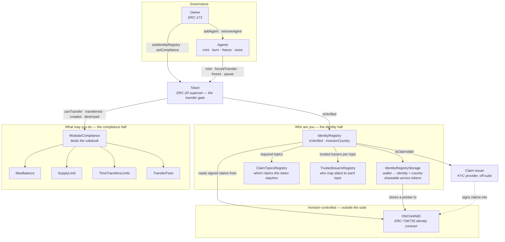
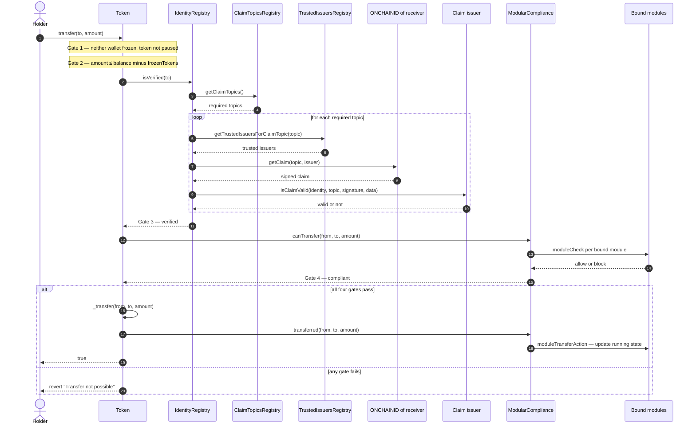

# ERC-3643 — the standard this repository implements

Reference for anyone reading the COTI port in [`private-ERC-3643-coti-port/`](private-ERC-3643-coti-port/).
It describes the **plaintext standard as published**, so that
[`MPC-CONFIDENTAL-IMPLEMENTATION.md`](MPC-CONFIDENTAL-IMPLEMENTATION.md) can describe only what changes.
Nothing here is COTI-specific.

Verified against the EIP text and against the published `@erc3643org/erc-3643@4.1.3`
package — the exact version this repository forks — on 20 September 2026.

---

## 1. What it is

**ERC-3643**, originally **T-REX** (*Token for Regulated EXchanges*), is a **Final**
Standards Track ERC, created 2021-07-09, requiring EIP-20 and EIP-173. It is an ERC-20
superset for security tokens: every transfer is gated on **who the parties are** and on
**a rulebook the issuer controls**.

The problem it solves is that a security is not a bearer instrument. A share cannot move
to an arbitrary address, because the issuer has to be able to answer to a regulator for
every holder on the register. ERC-3643 moves that check on-chain and into the transfer
path itself, rather than leaving it to an off-chain transfer agent.

It is the most widely adopted *standard* for permissioned tokens. That word matters —
it is a standard with a reference implementation, not a product. One thing follows, and
it catches people out: **the canonical repository ships a skeleton, not a rulebook.**
See §6.

---

## 2. The contracts

Six contracts plus a separate identity system:

| Component | Role |
| --- | --- |
| `Token` | ERC-20 superset. Every transfer gated on identity **and** compliance |
| `IdentityRegistry` | Maps a wallet to an ONCHAINID contract and a country code |
| `IdentityRegistryStorage` | The storage layer, shareable across several tokens |
| `ClaimTopicsRegistry` | Which claims *this token* requires — KYC, accreditation, … |
| `TrustedIssuersRegistry` | Which issuers may attest to each claim topic |
| `ModularCompliance` | Binds rule modules; each implements `moduleCheck` / `moduleTransferAction` |
| **ONCHAINID** | A per-investor identity contract (ERC-734/735) holding signed claims |

ONCHAINID is a separate project ([`onchain-id/solidity`](https://github.com/onchain-id/solidity))
and is deliberately not part of the token suite — the investor deploys and controls it.

### How they fit together

Two questions are answered by two different halves of the suite: **who are you** on the
left, **what are you allowed to do** on the right. The token is the only contract that
talks to both.



Three things the picture makes obvious that the table does not:

- **`Token` holds no eligibility logic of its own.** It asks two questions and acts on the
  answers. Swap either half and the token is unchanged.
- **The dashed edge is the only one an issuer does not control.** A claim issuer signs a
  claim into an identity contract the investor owns; the suite only ever *reads* it.
- **`IdentityRegistryStorage` sits behind the registry** so several tokens can share one
  KYC set. One onboarding, many securities.

The modules shown are illustrative. **They do not ship with the canonical repository** —
see §6, which is the single biggest practical gotcha in adopting the standard.
`TREXFactory`, `TREXGateway` and `TREXImplementationAuthority` deploy and upgrade whole
suites and are deliberately left out here; they sit above this picture, not in it.

### A transfer, end to end

The same contracts in motion. This is the plaintext standard — every arrow carries a
cleartext amount, and the failure path is a revert.



Two details in that flow matter more than their size suggests.

**`isVerified` is a loop, not a lookup.** Steps 2–11 run on every single transfer, and
steps 5–10 repeat once per required claim topic. This is where ERC-3643's gas cost lives,
and it is the direct price of the portable-credential model in §7.

**Step 17 is not a gate.** `transferred()` fires *after* the balance moves, so modules can
update running state — period totals, cooldowns, holder counts. That post-hoc write is why
compliance modules keep a **second ledger of balances** alongside the token's, and keeping
those two ledgers consistent is the hard problem under encryption
([`MPC-CONFIDENTAL-IMPLEMENTATION.md`](MPC-CONFIDENTAL-IMPLEMENTATION.md) §4.4).

## 3. The transfer gate

The whole standard is legible in one function:

```solidity
function transfer(address _to, uint256 _amount) public override whenNotPaused returns (bool) {
    require(!_frozen[_to] && !_frozen[msg.sender], "wallet is frozen");
    require(_amount <= balanceOf(msg.sender) - (_frozenTokens[msg.sender]), "Insufficient Balance");
    if (_tokenIdentityRegistry.isVerified(_to) && _tokenCompliance.canTransfer(msg.sender, _to, _amount)) {
        _transfer(msg.sender, _to, _amount);
        _tokenCompliance.transferred(msg.sender, _to, _amount);
        return true;
    }
    revert("Transfer not possible");
}
```

Four gates, in order:

1. **Wallet freeze** — neither party is frozen, and the token is not paused.
2. **Partial-freeze balance** — the *free* balance covers the amount. A holder can have
   tokens they cannot move.
3. **Identity verification** — `isVerified(_to)`.
4. **Modular compliance** — `canTransfer(from, to, amount)`.

Then a fifth step that is not a gate: `transferred()` notifies compliance *after* the
move, so stateful rules (running totals, cooldowns, per-period caps) can update.

**A blocked transfer reverts.** That is the standard's stated contract and it is the
single assumption that confidentiality breaks — a revert is a public, cleartext
disclosure of the compliance outcome. Everything in `MPC-CONFIDENTAL-IMPLEMENTATION.md` §4 follows
from that one line.

### How `isVerified` actually works

It is not a whitelist lookup. For the wallet's ONCHAINID, it walks **every claim topic
the token requires**, finds the **trusted issuers for that topic**, reads the claim from
the *investor's own* identity contract, and calls back into the issuer's `isClaimValid`.
Verification is therefore a live evaluation across three registries and an external
contract, not a stored boolean.

## 4. Agent powers

Owner (ERC-173) appoints agents (`addAgent` / `removeAgent` / `isAgent`). Agents hold the
powers a transfer agent needs in a regulated context:

- `mint` / `burn`, and the batch forms
- `forcedTransfer` — seizure, bypasses compliance but still requires a verified receiver
- `setAddressFrozen`, `freezePartialTokens`, `unfreezePartialTokens`
- `pause` / `unpause`
- `recoveryAddress(lostWallet, newWallet, investorOnchainID)` — reissue a holding to a
  new wallet on proof of identity, the on-chain analogue of a lost share certificate

`mint` and `forcedTransfer` bypass compliance; **`burn` bypasses every eligibility
check**. These exemptions are in the spec, not an implementation shortcut.

## 5. Interface surface

The token interface (beyond ERC-20):

```
onchainID() → address                      identityRegistry() → IIdentityRegistry
version() → string                         compliance() → ICompliance
paused() → bool                            isFrozen(address) → bool
getFrozenTokens(address) → uint256

setName / setSymbol / setOnchainID / setIdentityRegistry / setCompliance
pause / unpause / setAddressFrozen / freezePartialTokens / unfreezePartialTokens
forcedTransfer / mint / burn / recoveryAddress
batchTransfer / batchForcedTransfer / batchMint / batchBurn
batchSetAddressFrozen / batchFreezePartialTokens / batchUnfreezePartialTokens
```

Events: `UpdatedTokenInformation`, `IdentityRegistryAdded`, `ComplianceAdded`,
`RecoverySuccess`, `AddressFrozen`, `TokensFrozen`, `TokensUnfrozen`, `Paused`,
`Unpaused`.

Compliance (`ICompliance`) is deliberately tiny — four hooks and two bindings:

```
bindToken / unbindToken / isTokenBound / getTokenBound
canTransfer(from, to, amount) → bool      // view
transferred(from, to, amount)             // post-transfer state update
created(to, amount)                       // post-mint
destroyed(from, amount)                   // post-burn
```

Note `canTransfer` is **`view`**, and `IModule.moduleCheck` likewise:

```solidity
function moduleCheck(address _from, address _to, uint256 _value, address _compliance) external view returns (bool);
```

`view` is a correctness requirement in plaintext and an obstacle under encryption — an
MPC module may need to call on-chain handlers, which cannot run inside a `STATICCALL`.

Identity registry: `registerIdentity`, `deleteIdentity`, `updateIdentity`,
`updateCountry`, `batchRegisterIdentity`, `contains`, `isVerified`, `identity`,
`investorCountry`, plus the three registry setters and their getters.

## 6. The rulebook is not in the canonical repository

This is the most consequential practical fact about ERC-3643 today, and it is easy to
miss.

`ERC-3643/ERC-3643` ships the token, the registries and the **`ModularCompliance`
framework**. It does not ship working rules. Unpacking the published
`@erc3643org/erc-3643@4.1.3` package confirms it — `contracts/compliance/modular/modules/`
contains exactly five files:

```
AbstractModule.sol  AbstractModuleUpgradeable.sol  IModule.sol  ModuleProxy.sol  TestModule.sol
```

Four base classes and a test stub. The eleven concrete modules that make the framework
useful — `MaxBalance`, `SupplyLimit`, `TimeTransfersLimits`, `TransferFees`,
`CountryAllowModule`, `CountryRestrictModule` and the rest — exist only in the
**archived** [`TokenySolutions/T-REX`](https://github.com/TokenySolutions/T-REX)
repository.

**The standard is the skeleton; the rulebook is product code, and it is unmaintained at
its published location.** An issuer adopting ERC-3643 is adopting a framework plus a set
of modules they must vendor from an archived repo, write themselves, or buy.

The legacy `contracts/compliance/legacy/features/` directory in the v4.1.3 tree
(`MaxBalance`, `SupplyLimit`, `CountryRestrictions`, `DayMonthLimits`,
`ExchangeMonthlyLimits`, `ApproveTransfer`, `CountryWhitelisting`) is the **pre-modular**
design, retained for old deployments. It is not the modular module set.

### Deployment machinery

`TREXFactory` and `TREXGateway` deploy whole suites in one call;
`TREXImplementationAuthority` centralises upgrades across every token that trusts it.
This is how a platform operator runs many tokens on one codebase — and it means the
implementation authority address is a genuine control point worth checking on any
deployment you are evaluating.

## 7. The identity model is the real differentiator

Worth stating plainly, because it is what separates ERC-3643 from every issuer-registry
design:

**The investor holds the credential.** ONCHAINID is self-custodied and holds signed
claims from trusted issuers. Any ERC-3643 token decides independently which topics it
requires and which issuers it trusts. One KYC, many tokens, no re-onboarding.

Compare an issuer-owned registry (DS Protocol and most others), where your KYC lives in
*their* database, per issuer, and onboarding to a second token means doing it again.

That portability is the standard's strongest claim. It also explains why the compliance
surface is heavier: because the token cannot assume a curated registry, it must evaluate
more at transfer time — which is precisely the work that becomes expensive under
encryption.

## 8. What the standard assumes that encryption breaks

A checklist to read `MPC-CONFIDENTAL-IMPLEMENTATION.md` against. Each of these is load-bearing in
plaintext ERC-3643:

| Assumption | Where it appears | Why encryption breaks it |
| --- | --- | --- |
| A blocked transfer **reverts** | `transfer`, `transferFrom` | The revert publicly discloses the compliance outcome |
| `canTransfer` / `moduleCheck` are **`view`** | `ICompliance`, `IModule` | MPC evaluation may need on-chain handlers, impossible under `STATICCALL` |
| Balances are readable `uint256` | `balanceOf`, `getFrozenTokens` | The value is the thing being protected |
| Compliance modules keep a **second ledger** of balances | `MaxBalanceModule` and others | That shadow ledger must stay consistent with the token's, under encryption |
| Agents can **read** a holder's position to supervise | `getFrozenTokens`, `balanceOf` | Read access must now be granted explicitly, per reader, at write time |
| Amounts are plain arguments in the ABI | every amount-taking function | Encrypted inputs need a signed, sender-bound ciphertext type |

## 9. References

| Resource | Link |
| --- | --- |
| The EIP | https://eips.ethereum.org/EIPS/eip-3643 |
| Developer documentation | https://docs.erc3643.org/ |
| Canonical contracts | https://github.com/ERC-3643/ERC-3643 |
| Association | https://www.erc3643.org/ |
| ONCHAINID contracts | https://github.com/onchain-id/solidity |
| Whitepaper (T-REX v4) | https://tokeny.com/wp-content/uploads/2023/05/ERC3643-Whitepaper-T-REX-v4.pdf |
| Deprecated origin repo | https://github.com/TokenySolutions/T-REX (archived 2026-07-15) |

The three files worth reading first are `token/Token.sol`,
`registry/implementation/IdentityRegistry.sol` and
`compliance/modular/ModularCompliance.sol`. All three are present, unmodified, in
[`private-ERC-3643-coti-port/tree/contracts/`](private-ERC-3643-coti-port/tree/contracts/).

---

**Next:** [`MPC-CONFIDENTAL-IMPLEMENTATION.md`](MPC-CONFIDENTAL-IMPLEMENTATION.md) — what this repository adds,
and what it does not.
