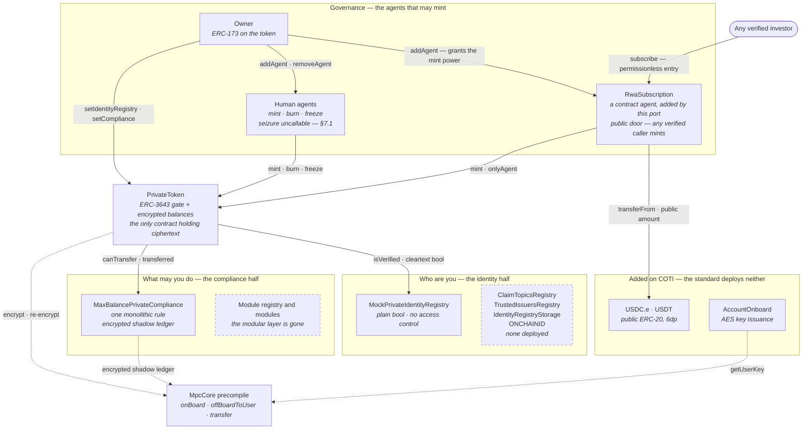
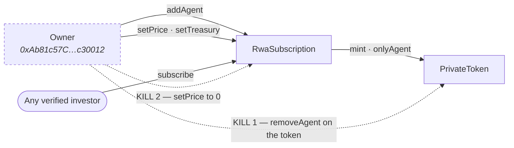

# ERC-3643 MPC Implementation

ERC-3643 is the standard for regulated tokens, but everything is public: balances, transfer sizes, the whole cap table. No fund can accept that.  This project ports T-REX to COTI's garbled-circuit MPC so that balances, allowances and transfer amounts are ciphertext on-chain, while identity checks and compliance still run, and compliance evaluates the encrypted values directly.

Read [`ERC-3643-STANDARD.md`](ERC-3643-STANDARD.md) first. This document assumes it, and
describes only the delta: what the COTI port adds to ERC-3643 v4.1.3, what it removes,
and what it breaks.

**Nothing here is audited.** Two of the changes below are silent failures that present a
correct-looking ABI while meaning something else — §7 is the section to read before any
integration work.

Verified against the working tree and against COTI testnet (chain `7082400`) on
20 September 2026.

---

## 1. What is in the repository

```
app/                            React + wagmi front end (the part a person can be shown)
private-ERC-3643-coti-port/
  README.md                     engineering record: phases, deploy log, chain verification
  tree/                         the fork itself — contracts, tests, scripts, deployments
```

`app/src/data/deployment.json` is a copy of
`private-ERC-3643-coti-port/tree/deployments/rwa-demo.json`. **They must stay identical**
or the site points at the wrong contracts. They are in sync as of 20 September 2026.

## 2. The contracts

Laid out to match [`ERC-3643-STANDARD.md`](ERC-3643-STANDARD.md) §2, so the standard and
this port can be read side by side. Every address links to cotiscan on COTI testnet
(chain `7082400`).


| ERC-3643 component        | In this port                                                                                                            | JTRSY                                                                                                | JAAA                                                                                                 |
| ------------------------- | ----------------------------------------------------------------------------------------------------------------------- | ---------------------------------------------------------------------------------------------------- | ---------------------------------------------------------------------------------------------------- |
| `Token`                   | `PrivateToken` — encrypted balances, 8dp                                                                               | [`0x6D7cf587…Baf3`](https://testnet.cotiscan.io/address/0x6D7cf587dbF68eb233B7BEd1f45BDfB6aE31Baf3) | [`0x20b2C3cc…6732`](https://testnet.cotiscan.io/address/0x20b2C3cc4F7b4a5f727b1aa69779aD9C20036732) |
| `IdentityRegistry`        | `MockPrivateIdentityRegistry` — **a stub** (§5)                                                                       | [`0x9Da490af…5F37`](https://testnet.cotiscan.io/address/0x9Da490afb22cEb1B8aA82d2EC4418BB4A62e5F37) | [`0xC64DC851…a23E`](https://testnet.cotiscan.io/address/0xC64DC85109E823380ea4DE34b6ac1B22a02Ba23E) |
| `IdentityRegistryStorage` | **absent**                                                                                                              | —                                                                                                   | —                                                                                                   |
| `ClaimTopicsRegistry`     | **absent**                                                                                                              | —                                                                                                   | —                                                                                                   |
| `TrustedIssuersRegistry`  | **absent**                                                                                                              | —                                                                                                   | —                                                                                                   |
| `ModularCompliance`       | `MaxBalancePrivateCompliance` — **monolithic** (§4.4)                                                                 | [`0xB5d2e888…28CB`](https://testnet.cotiscan.io/address/0xB5d2e8880005dCF84f13Fc58626d7F67734E28CB) | [`0x2abfd119…a531`](https://testnet.cotiscan.io/address/0x2abfd1194120fb2BDc2D3Fd8366C2979c7aea531) |
| **ONCHAINID**             | **absent**                                                                                                              | —                                                                                                   | —                                                                                                   |
| `AgentRole` †             | [`RwaSubscription`](#61-rwasubscription--the-primary-issuance-till) — **a bearer of the token's agent role, externalised into a contract**. Its primary-market function has no counterpart (§6.1) | [`0x5cf23F0c…A98f`](https://testnet.cotiscan.io/address/0x5cf23F0cf6369477d1F267e5f9F281C3e6B8A98f) | [`0x0A1089dc…1bf9`](https://testnet.cotiscan.io/address/0x0A1089dc8b71E463c3AD89363058B5a07A7f1bf9) |

† `AgentRole` is not one of the standard's seven deployable components, which is why it
does not appear in [`ERC-3643-STANDARD.md`](ERC-3643-STANDARD.md) §2. It is a **base
class** — `Token`, `IdentityRegistry` and `IdentityRegistryStorage` each inherit
`AgentRoleUpgradeable`, so the role lives *inside* those contracts and its bearers are
ordinary addresses in a mapping. `RwaSubscription` is one such bearer, except that it is a
contract with its own address and its own public entry point rather than a person or a
multisig. The standard does deploy one agent as a contract in its own right —
`TREXGateway is AgentRole` — which is the closest precedent (§6.1).

Shared by both funds, deployed once:


| Contract                               | Address                                                                                              | Note                                                       |
| -------------------------------------- | ---------------------------------------------------------------------------------------------------- | ---------------------------------------------------------- |
| [`AccountOnboard`](#62-accountonboard) | [`0x68603585…C825`](https://testnet.cotiscan.io/address/0x686035856C60D73843C839ad50eDC6c40385C825) | AES key issuance. The front end does not use it (§6.2)    |
| `USDC.e`                               | [`0x63f3D2Cc…D19C`](https://testnet.cotiscan.io/address/0x63f3D2Cc8F5608F57ce6E5Aa3590A2Beb428D19C) | Pre-existing testnet token.**Ordinary public ERC-20**, 6dp |
| `USDT`                                 | [`0x9e961430…3Cf0`](https://testnet.cotiscan.io/address/0x9e961430053cd5AbB3b060544cEcCec848693Cf0) | Pre-existing testnet token.**Ordinary public ERC-20**, 6dp |

### How they fit together

The same shape as the standard's diagram, with what is missing drawn in rather than
omitted. Dashed boxes are **not deployed**.



Four differences from the standard's picture are worth naming:

- **The identity half collapsed to one box.** In the standard, `IdentityRegistry` fans out
  to three registries and an investor-owned ONCHAINID. Here it terminates in a stored
  boolean, and nothing fans out at all.
- **The compliance half has no modules.** `MaxBalancePrivateCompliance` *is* the rulebook,
  not a binder of rules (§4.4).
- **`RwaSubscription` is one of the agents.** It holds the token's `onlyAgent` mint
  privilege, exactly as a human transfer agent does. What differs is the **door**: the
  standard's agents are discretionary actors who decide when to mint, and this one mints
  for anyone verified who pays (§6.1).
- **Its two edges are both public.** Pulling a plain ERC-20 and minting as an agent — the
  atomic-settlement gain and the public-payment-leg cost, in one path (§6.1).

### The port is purely additive

The single most useful fact about this fork, and it is mechanically checkable:

```sh
npm pack @erc3643org/erc-3643@4.1.3 && tar xzf erc3643org-erc-3643-4.1.3.tgz
diff -rq package/contracts private-ERC-3643-coti-port/tree/contracts
```

**All 66 upstream `.sol` files are byte-identical.** Not one line of ERC-3643 v4.1.3 was
edited. `diff` reports only additions:


| Added path                                                   | Files | Lines  | What it is                                                 |
| ------------------------------------------------------------ | ----- | ------ | ---------------------------------------------------------- |
| `contracts/bubble/`                                          | 3     | 14,760 | Vendored COTI`MpcCore`, `MpcInterface`, `DecryptionCaller` |
| `contracts/token/PrivateToken.sol`                           | 1     | 1,082  | The confidential token, beside untouched`Token.sol` (595)  |
| `contracts/token/PrivateTokenStorage.sol`                    | 1     | 145    | Its storage layout                                         |
| `contracts/token/IPrivateToken.sol`                          | 1     | 471    | Its interface, beside untouched`IToken.sol` (460)          |
| `contracts/compliance/modular/IPrivateModularCompliance.sol` | 1     | 234    | Compliance interface with encrypted`canTransfer`           |
| `contracts/registry/interface/IPrivateIdentity*.sol`         | 2     | 17     | Minimal identity interfaces                                |
| `contracts/roles/private/`                                   | 2     | 58     | `AgentRoleUpgradeable`, `Roles`                            |
| `contracts-private/`                                         | 5     | 356    | Demo and test contracts — outside the fork tree entirely  |

The private stack **sits beside** the plaintext one rather than replacing it. A reviewer
who knows T-REX can diff this tree against upstream and get a clean, empty answer for
every file they already trust.

## 3. The type changes


| Surface                             | Plaintext T-REX                     | This port                                                         |
| ----------------------------------- | ----------------------------------- | ----------------------------------------------------------------- |
| Balances, allowances, frozen tokens | `uint256`                           | **`utUint256` / `ctUint256` ciphertext in storage**               |
| Total supply                        | `uint256`                           | `uint256` — **stays public**                                     |
| Identity registry                   | `isVerified`, `investorCountry`     | **unchanged, cleartext** — `bool` and `uint16`                   |
| `canTransfer`                       | `view returns (bool)`               | **non-`view`, `returns (gtBool)`**                                |
| Failed transfer                     | `revert("Transfer not possible")`   | **never reverts** — moves an encrypted zero                      |
| Mint / burn                         | synchronous                         | **async** — decrypt request plus `callbackMint` / `callbackBurn` |
| Compliance modules                  | framework + 11 in the archived repo | **one monolithic contract**, marked test-only                     |
| `version()`                         | `"4.1.3"`                           | `"0.0.1"`                                                         |

Three COTI types carry the whole design, and the distinction between them is what most of
the port is about:

- **`gtUint256`** — a *garbled handle*. Live only **inside one transaction**. It can be
  passed between contracts in the same call, and it cannot be stored or returned to a
  caller.
- **`ctUint256`** — a *ciphertext*, readable by **exactly one** holder of an AES key.
  This is what goes in storage and what a user decrypts off-chain.
- **`itUint256`** — an *input* ciphertext plus a signature binding it to the sender and
  the function selector. This is how a user supplies an encrypted amount.

## 4. The five structural changes

### 4.1 Read access is granted at write time

COTI has no runtime permit model — no `permit`, `permitThis`, `permitTransient`. There is
no way to hold an encrypted value and decide later who may read it. Every write is instead
an `offBoardToUser(gt, addr)` naming its reader.

The upstream original had 61 `permit` call sites. **There are now none** — the only remaining
occurrences of the word in `PrivateToken.sol` are seven comments explaining what replaced
it. Each one became an explicit decision about *whom to encrypt to*, which is the single
largest piece of work in the port and also the more auditable model: read access is
visible in the code that writes the value.

The consequence is an **eager multi-copy write**. A balance is a `utUint256` —
`{ contract copy, holder copy }` — written through `MpcCore.offBoardCombined`. An
allowance needs three ciphertexts, because owner and spender must each read it:

```solidity
struct PrivateAllowance {
    ctUint256 ciphertext;          // contract copy — the source of truth
    ctUint256 ownerCiphertext;
    ctUint256 spenderCiphertext;
}
```

**Agents are the case this model cannot pre-compute.** The agent set is a role and
therefore unbounded, so no eager slot can exist for it. Instead an agent calls
`reencryptFrozenTokens(holder)` and reads its own copy back from
`_frozenTokensForReader[reader][holder]`. That works for the *frozen* amount. **A
supervisor who needs to read a holder's actual balance has no path at all** — an open gap,
not an oversight.

### 4.2 Storage holds ciphertext, not handles

The upstream design kept long-lived `gtUint256` handles in storage. On COTI a handle cannot
survive a transaction boundary, so balances became `utUint256`, on-boarded at the top of
each transaction and off-boarded at the end. This touched every storage read and write in
the token and in the compliance module.

The canonical encrypted zero shows the shape of the change — it used to be a stored
handle, and is now minted per call:

```solidity
/// @dev Retained to preserve the storage layout.
uint256 internal _mpcZeroBalanceHandleDeprecated;
```

The `__gap` is correspondingly reduced from 45 to 43 slots for
`_frozenTokensForReader` and `_accountEncryptionAddress`.

### 4.3 Decryption is synchronous, which *removes* machinery

`MpcCore.decrypt(gtUint256) returns (uint256)` returns in-transaction. The upstream async
decrypt apparatus — request mappings, batch-burn user lists, relayer callbacks — collapses
into inline calls, and `MintRequested` / `MintFinalized` fire in the **same transaction**.

The async remnants that survive (`_burnRequests`, `_mintRequests`, `_batchBurnUsers`,
`callbackMint`, `callbackBurn`) exist for one reason only: **`_totalSupply` is a public
`uint256`**. Burning an encrypted amount requires learning how much was actually burned in
order to keep the public figure honest.

**The asynchrony is a consequence of a design choice, not of the cryptography.** Keep
supply encrypted — as COTI's own `PrivateERC20` does — and the whole apparatus disappears.

### 4.4 Modular compliance is collapsed, not ported

This is the largest functional gap and it is understated by the phrase "one module of
eleven".

`IPrivateModularCompliance` still *declares* the modular surface —
`addModule`, `removeModule`, `callModuleFunction`, `getModules`, `isModuleBound`. But the
deployed contract, `MaxBalancePrivateCompliance`, is declared as:

```solidity
contract MaxBalancePrivateCompliance is Ownable {
```

It does **not** implement that interface. It implements the six functions the token
actually calls — `bindToken`, `unbindToken`, `canTransfer`, `transferred`, `created`,
`destroyed` — and nothing else. There is no module registry, no `addModule`, no
`moduleCheck`. **The modular layer is gone**, replaced by a single monolithic rule.
`getModules()` on the deployed funds is not "empty", it is absent.

What the one rule does prove is the hard part. `MaxBalancePrivateCompliance` keeps
`_trackedBalancePrivate`, an **encrypted shadow ledger** parallel to the token's — the
second ledger `MaxBalanceModule` keeps per ONCHAINID, which must stay consistent with the
token's under encryption. It works, with `checkedSubWithOverflowBit` and `mux` standing in
for the branches a plaintext module would take. The dual-ledger problem is solved in
practice, not only on paper.

What is not attempted: the four rolling accumulators (`TimeTransfersLimits`,
`ExchangeMonthlyLimits`, …) and the fee-derived nested transfer (`TransferFees`) — the
genuinely hard items.

### 4.5 Failure became silent

`transfer` returns `gtBool`, and a blocked transfer moves an **encrypted zero** rather
than reverting:

```solidity
gtUint256 transferredAmount = MpcCore.mux(_canTransfer, _zero(), _amount);
```

This is necessary — a revert would leak the compliance outcome in cleartext — and it is
the deepest break with ERC-20. **A transaction can succeed on-chain while transferring
nothing**, and the caller cannot tell which happened without decrypting the result. Every
integrator downstream of such a token has to be rewritten to check a ciphertext instead of
a revert.

The test suite pins this: an unverified recipient, an over-cap transfer and an
over-balance transfer all move an encrypted zero without reverting, and the free-balance
boundary is exact — freeze 400 of 1,000, and 600 passes while 601 blocks.

## 5. The identity registry is a mock

The deployed registry is `MockPrivateIdentityRegistry` — six functions over three plain
mappings:

```solidity
mapping(address => bool) public verified;
function setVerified(address _userAddress, bool _isVerified) external { ... }
```

Against the standard's `IdentityRegistry`: no ONCHAINID, no `ClaimTopicsRegistry`, no
`TrustedIssuersRegistry`, no claim walk, no `isClaimValid` callback. Verification is a
stored boolean, and **`setVerified`, `registerIdentity` and `deleteIdentity` carry no
access control whatsoever** — anyone can verify anyone.

For a demo that is the point; the flow is meant to be drivable. For anything else it means
**the identity half of ERC-3643 is not implemented in this repository at all**. That half
is, per §8 of the standard doc, the standard's strongest claim. Note also that the
registry stays **cleartext by design** — `isVerified` returns a plain `bool` and
`investorCountry` a plain `uint16`. Confidentiality here covers amounts, not eligibility.

## 6. The governance model: self-service for compliant accounts

ERC-3643 assumes an **operator acts for the investor**. An agent decides when to mint and
to whom; the investor's own keys sit outside the standard entirely. Both contracts in this
section invert that: a verified account **subscribes for itself**, and **onboards its own
key**, with no operator in the loop for either.

That is the substantive change, and it is a governance change rather than a cryptographic
one. The authority is ordinary ERC-3643 authority — `RwaSubscription` holds the token's
agent role — but it is exercised automatically, on conditions written into the contract,
instead of at an operator's discretion. What those conditions are, and what governance
surface the contract does *not* have, is most of what follows.

### 6.1 `RwaSubscription` — the primary-issuance till

[`contracts-private/RwaSubscription.sol`](private-ERC-3643-coti-port/tree/contracts-private/RwaSubscription.sol),
109 lines. An investor calls `subscribe(paymentToken, amount)`; the stablecoin leg settles
to the treasury and the encrypted shares mint **in one atomic transaction**. T-REX has no
*primary-market* counterpart, because issuance there is assumed to happen off-chain: on
Avalanche the entire DMF supply arrived in two agent `batchMint` calls with no payment leg
on-chain at all. Removing that counterparty risk is a genuine improvement on the incumbent
flow. Its *authority*, though, is ordinary ERC-3643 authority — see the governance
subsection below.

#### The full surface

Eight functions, three events, five custom errors — the whole contract fits on a page.


| Function                                                            | Who                | What it does                                                             |
| ------------------------------------------------------------------- | ------------------ | ------------------------------------------------------------------------ |
| `subscribe(address paymentToken, uint256 paymentAmount) → uint256` | anyone**verified** | The only state-changing call an investor makes. Returns the share count  |
| `quote(address paymentToken, uint256 paymentAmount) → uint256`     | view               | Shares a payment would buy, for a UI to show before committing           |
| `setPrice(address paymentToken, uint256 price)`                     | owner              | Sets or unsets a payment token.**Price 0 means not accepted**            |
| `setTreasury(address)`                                              | owner              | Where payment settles                                                    |
| `priceOf(address) → uint256`                                       | view               | Payment-token units per`1e8` shares                                      |
| `owner() → address` · `treasury() → address`                     | view               | Governance getters                                                       |
| `token() → address`                                                | view               | The fund token.**`immutable`** — one subscription per fund, permanently |

Events: `Subscribed(address indexed buyer, address indexed paymentToken, uint256 paymentAmount, uint256 shares)`,
`PriceSet(address indexed paymentToken, uint256 price)`,
`TreasurySet(address indexed treasury)`.

Errors: `NotOwner`, `TokenNotAccepted`, `NotVerified`, `NothingToBuy`, `PaymentFailed`.

#### What `subscribe` actually does

[`RwaSubscription.sol:89-108`](private-ERC-3643-coti-port/tree/contracts-private/RwaSubscription.sol#L89-L108),
in order:

1. **Look up the price.** `priceOf[paymentToken]`; zero reverts `TokenNotAccepted`.
2. **Check eligibility.** `token.identityRegistry().isVerified(msg.sender)` — the ERC-3643
   gate, reached through the token rather than held locally, so the subscription can never
   drift from the fund's own registry. Fails with `NotVerified`.
3. **Compute shares.** `paymentAmount * 1e8 / price`. Zero reverts `NothingToBuy`.
4. **Pull payment.** `transferFrom(msg.sender, treasury, paymentAmount)` — straight to the
   treasury, so **the contract never custodies funds**. A `false` return reverts
   `PaymentFailed`.
5. **Mint.** `token.mint(msg.sender, shares)`, which requires this contract to be an agent
   on the token — the deploy script adds it. Shares land encrypted.
6. **Emit** `Subscribed` and return the share count.

The caller must `approve` the payment token for this contract first. That is an ordinary
ERC-20 approval, because the payment tokens are ordinary ERC-20s.

#### Atomic delivery-versus-payment

Steps 4 and 5 share **one transaction**, not merely one block, so EVM semantics make the
cash leg and the delivery leg succeed or revert together. The investor never pays into a
pending state, and the contract never custodies funds — payment goes straight to the
treasury. Every rejection above reverts the whole call: `TokenNotAccepted`, `NotVerified`,
`NothingToBuy` and `PaymentFailed` all leave no half-settled state behind.

Measured against the incumbent flow, that is the gain. On Avalanche the whole DMF supply
arrived through agent `batchMint` calls with no payment leg on chain at all: the investor
paid first, off-chain, and trusted the issuer to mint afterwards. Here that exposure is
gone.

**One exception, and an issuer should know it.** `PrivateToken.mint` does **not** revert
when compliance blocks a mint. It mints an encrypted zero, the same `mux` pattern as a
blocked transfer (§4.5):

```solidity
gtBool transferAllowed = _tokenCompliance.canTransfer(address(0), _to, privateAmount);
gtUint256 minted = MpcCore.mux(transferAllowed, _zero(), privateAmount);
```

Payment settles at step 4, *before* the mint at step 5. So a subscription that trips the
compliance cap **takes the cash and delivers nothing, without reverting** — which is
precisely the settlement risk DvP exists to remove.

On the deployed funds this is latent rather than live. `maxBalance` reads `0` on both
compliance contracts, and `_exceedsLimit` returns false whenever the limit is zero, so
today every mint delivers in full. Set a per-investor cap and the hole opens. Closing it
has to happen on the token side — `mint` returns nothing, so `subscribe` cannot inspect
the result and revert on a zero delivery.

#### Governance: it is a token agent, and that is the whole story

The deploy script does one line that changes what this contract *is*:

```ts
await (await token.addAgent(subscription.address)).wait();
```

`PrivateToken.mint` is `onlyAgent`, so the subscription holds the same privilege a human
transfer agent holds. It is not an external contract that happens to call the token — it
is a **governance principal**, which is why the §2 diagram places it among the agents.

What changes is the *kind* of principal. ERC-3643 assumes agents are **discretionary
actors**: a person or multisig decides when to mint. This one is an **automaton with a
public door** — any verified address can cause a mint by paying. The governance question
stops being "who may mint" and becomes "what conditions cause a mint", and only two are
encoded: verified, and payment received.



#### What it lacks against `AgentRole`, the standard's governance contract

ERC-3643's governance contract is
[`contracts/roles/AgentRole.sol`](private-ERC-3643-coti-port/tree/contracts/roles/AgentRole.sol)
— OpenZeppelin `Ownable` plus a `Roles.Role` mapping. `Token` and `PrivateToken` both
inherit `AgentRoleUpgradeable`. `RwaSubscription` inherits nothing and reimplements
ownership in four lines:

| `AgentRole` / `Ownable` provides | In `RwaSubscription` |
| --- | --- |
| `Ownable`, ERC-173, by inheritance | hand-rolled `address public owner` |
| `transferOwnership` | **absent** |
| `renounceOwnership` | **absent** |
| `OwnershipTransferred` event | **absent** |
| `addAgent` / `removeAgent` / `isAgent` | **absent** — no role layer at all |
| `AgentAdded` / `AgentRemoved` events | **absent** |
| `onlyAgent` modifier | **absent** — only `onlyOwner` |
| `pause` / `unpause` | **absent** |

Three consequences, and the first is not this port's fault:

- **Pausing the token does not stop issuance.** `PrivateToken.mint` is `onlyAgent` with no
  `whenNotPaused` — and **upstream `Token.mint` is identical**, while `transfer` *is*
  `whenNotPaused`. So this is inherited from ERC-3643. But in the standard it stays latent,
  because the agent is a person who simply stops calling `mint`. Here the agent is a
  contract with a public entry point, so "stop calling it" is not available to anyone:
  pause the token and `subscribe` still mints.
- **The repo is internally inconsistent.** Its sibling is
  `contract MaxBalancePrivateCompliance is Ownable` — real OpenZeppelin `Ownable`, with
  transfer and renounce. Same repo, same deployment, two different ownership models.
- **Two kill switches exist, neither on this contract.** `token.removeAgent(subscription)`
  stops minting outright, and `setPrice(paymentToken, 0)` makes `subscribe` revert
  `TokenNotAccepted`. Both work — but one lives on another contract and the other is a
  magic-value side effect, rather than the `pause()` an operator would go looking for.

#### What ERC-3643 ships instead

Two answers, because issuance and governance are different layers.

**For governance, `AgentRole` is the default implementation** — there is no other
governance contract in the standard. `AgentRoleUpgradeable` is the same over
`OwnableUpgradeable`, and that is what the token inherits.

**For issuance there is no default at all, because ERC-3643 has no primary market.**
Issuance is an agent calling `mint` or `batchMint`, with subscription, payment and
allocation handled off-chain — which is exactly why the Avalanche DMF supply arrived in
two `batchMint` calls with no payment leg on chain.

There is, however, a structural precedent the port could have followed.
[`TREXGateway`](private-ERC-3643-coti-port/tree/contracts/factory/TREXGateway.sol) is
declared `contract TREXGateway is AgentRole`: a public entry point that pulls a fee via
`transferFrom` to a `feeCollector`, with a public/permissioned toggle, a deployer
allowlist, per-caller fee discounts and batch operations. That is the same shape as
`RwaSubscription` — a priced, permissioned door — built on `AgentRole` as the standard
intends. It governs *deployment* rather than issuance, so it is not a drop-in, but it is
the in-repo answer to how ERC-3643 writes this kind of contract.

#### Five things to know before integrating

- **`quote` returns 0 for an unaccepted token, it does not revert.** A UI that does not
  special-case zero will render "0 shares" where the honest message is "this token is not
  accepted". `subscribe` *does* revert on the same input, so the two disagree by design.
- **There is no slippage or deadline protection.** `setPrice` takes effect immediately and
  `subscribe` recomputes from the live price, so the price can move between a user's quote
  and their transaction. For a fixed-price primary market with one owner this is a known
  shape, not a bug — but nothing in the contract bounds it.
- **Ownership is permanent.** There is no `transferOwnership` and no renounce; `owner` is
  set once in the constructor. Lose that key and prices and treasury are frozen forever.
  Both deployed subscriptions are owned by `0xAb81c57C…c30012`, which is also the treasury
  and the token agent.
- **Integer division truncates, and the dust favours the issuer.** 100 USDC.e at
  `1112439` yields `8989256939` shares, discarding the remainder.
- **It is one-way.** There is no redemption, no refund and no pause. Shares can be
  subscribed for and never sold back through this contract.

#### The disclosure it carries

The contract documents its own privacy cost rather than hiding it:

> PRIVACY NOTE, deliberately not hidden: USDC and USDT on COTI testnet are ordinary
> ERC-20s with public amounts. The payment leg of a subscription is therefore visible,
> and because the price is public the share count follows from it.

**Confidentiality protects the holding, not the purchase.** Confirmed on chain: in
`0x8ffe8404…df788` the `Subscribed` event carries `paymentAmount = 100000000` and
`shares = 8989256939` as plain integers. Note the shape of the leak — it is not that the
event is verbose, it is that **any** public payment leg plus a public price determines the
share count arithmetically. The encrypted `Transfer` protects the position from then on;
it does not protect its acquisition.

#### Closing it

COTI already publishes confidential payment tokens — `PrivateBridgedUSDC` (**`p.USDC.e`**,
6dp) and `PrivateTetherUSD` (**`p.USDT`**), both `PrivateERC20` subclasses. Settling the
payment leg in one of those, or off-chain, is what closes this gap.

### 6.2 `AccountOnboard`

23 lines, verbatim from `coti-io/coti-contracts` with the import repointed, so a signer can
obtain its own AES key without an operator issuing one. That is the self-service half of
the model above, and it does happen — but **not through this deployment**. The front end
does not touch this contract, because onboarding belongs to the COTI wallet plugin, which
ships its own copy. This one exists for the test fixtures, where each signer needs a key of
its own before a multi-party test means anything.

## 7. Integration traps

Both of these present a correct-looking interface and mean something else. A missing
function fails loudly; these do not.

### 7.1 Four functions are ABI-identical and semantically incompatible

`type gtUint256 is uint256` is a user-defined value type and therefore **invisible in an
ABI**. These four take `gtUint256`:

```
forcedTransfer(address,address,uint256)
batchForcedTransfer(address[],address[],uint256[])
batchFreezePartialTokens(address[],uint256[])
batchUnfreezePartialTokens(address[],uint256[])
```

They present an **exact signature match** to any ERC-3643 tooling, which will encode a
plaintext amount that the contract reads as a garbled handle. A handle cannot survive a
transaction boundary, so these are **uncallable from outside**. Agent seizure and batch
freezing do not work and need `itUint256` parameters. Two tests pin the behaviour.

The eight functions that were converted correctly take `itUint256`: `transfer`,
`transferFrom`, `approve`, `increaseAllowance`, `decreaseAllowance`, `batchTransfer`,
`freezePartialTokens`, `unfreezePartialTokens`.

### 7.2 `PrivateToken` differences from a standard ERC-20

`PrivateToken` exposes 58 functions and 21 events. Three failure modes, and two are
silent:

- **`transfer`, `transferFrom`, `approve` change selector.** An ERC-20 client's call
  reverts — loud, and nobody loses anything to a misunderstanding.
- **`balanceOf` and `allowance` keep their selectors** while returning 64 bytes instead of
  32. A client decoding the first word reads `ciphertextHigh` and displays a plausible,
  enormous, meaningless balance. Confirmed against ethers v6, which does not throw on the
  extra word. MetaMask's "import token" fails this way.
- **`Transfer` and `Approval` carry a different `topic0`.** No indexer, explorer or
  subgraph matches a single log, and **the token appears to have no activity whatsoever**.
  That is the failure most easily mistaken for "the transaction didn't work".

Reading a balance therefore means: call `balanceOf(address)` with the tuple ABI, take the
`ctUint256`, and decrypt it off-chain with the holder's AES key.

```
function balanceOf(address) view returns (tuple(uint256 ciphertextHigh, uint256 ciphertextLow))
```

#### What it *is* native to

Read the other way round, the token is not a broken ERC-20 — it is a **COTI private
token**, and COTI's own tooling handles it without modification. `balanceOf` returns
exactly the `ctUint256` shape that `PrivateERC20` returns, which is the shape the whole
COTI stack is built around:

| Tool | How it handles this token |
| --- | --- |
| **COTI MetaMask Snap** — `npm:@coti-io/coti-snap` | Holds the account's AES key and performs the decryption. It is key custody, not a balance viewer: it never enumerates or displays tokens |
| **COTI privacy wallet** — `metamask.coti.io` | Built on that same Snap and the same `ctUint256` shape |
| **`@coti-io/coti-wallet-plugin`** | Reads it unmodified through its `version: 256` path. Pass `decimals: 8` |

So an integrator's job is not to make an ERC-20 client cope. It is to use the COTI
libraries, which already expect a 64-byte `balanceOf` and a holder-side AES key.

## 8. What is deployed

COTI testnet, chain `7082400`. Deployed 10 August 2026 by
[`scripts/deploy-rwa-demo.ts`](private-ERC-3643-coti-port/tree/scripts/deploy-rwa-demo.ts),
recorded in `deployments/rwa-demo.json`. Two funds, four contracts each, plus one shared
`AccountOnboard`. §2 shows the same addresses mapped onto their ERC-3643 roles; this is
the deployment record.

### The demo fund stack


| Contract                                                            | JTRSY — Janus Henderson Treasury Fund                                                                                         | JAAA — Janus Henderson AAA CLO Fund                                                                                           |
| ------------------------------------------------------------------- | ------------------------------------------------------------------------------------------------------------------------------ | ------------------------------------------------------------------------------------------------------------------------------ |
| `PrivateToken`                                                      | [`0x6D7cf587dbF68eb233B7BEd1f45BDfB6aE31Baf3`](https://testnet.cotiscan.io/address/0x6D7cf587dbF68eb233B7BEd1f45BDfB6aE31Baf3) | [`0x20b2C3cc4F7b4a5f727b1aa69779aD9C20036732`](https://testnet.cotiscan.io/address/0x20b2C3cc4F7b4a5f727b1aa69779aD9C20036732) |
| `MockPrivateIdentityRegistry`                                       | [`0x9Da490afb22cEb1B8aA82d2EC4418BB4A62e5F37`](https://testnet.cotiscan.io/address/0x9Da490afb22cEb1B8aA82d2EC4418BB4A62e5F37) | [`0xC64DC85109E823380ea4DE34b6ac1B22a02Ba23E`](https://testnet.cotiscan.io/address/0xC64DC85109E823380ea4DE34b6ac1B22a02Ba23E) |
| `MaxBalancePrivateCompliance`                                       | [`0xB5d2e8880005dCF84f13Fc58626d7F67734E28CB`](https://testnet.cotiscan.io/address/0xB5d2e8880005dCF84f13Fc58626d7F67734E28CB) | [`0x2abfd1194120fb2BDc2D3Fd8366C2979c7aea531`](https://testnet.cotiscan.io/address/0x2abfd1194120fb2BDc2D3Fd8366C2979c7aea531) |
| [`RwaSubscription`](#61-rwasubscription--the-primary-issuance-till) | [`0x5cf23F0cf6369477d1F267e5f9F281C3e6B8A98f`](https://testnet.cotiscan.io/address/0x5cf23F0cf6369477d1F267e5f9F281C3e6B8A98f) | [`0x0A1089dc8b71E463c3AD89363058B5a07A7f1bf9`](https://testnet.cotiscan.io/address/0x0A1089dc8b71E463c3AD89363058B5a07A7f1bf9) |
| Share price                                                         | 1.112439                                                                                                                       | 1.044450                                                                                                                       |

Shares are 8dp.

### Shared contracts


| Contract                               | Address                                                                                                                        | Note                                                       |
| -------------------------------------- | ------------------------------------------------------------------------------------------------------------------------------ | ---------------------------------------------------------- |
| [`AccountOnboard`](#62-accountonboard) | [`0x686035856C60D73843C839ad50eDC6c40385C825`](https://testnet.cotiscan.io/address/0x686035856C60D73843C839ad50eDC6c40385C825) | AES key issuance; the front end does not use it (§6.2)    |
| `USDC.e`                               | [`0x63f3D2Cc8F5608F57ce6E5Aa3590A2Beb428D19C`](https://testnet.cotiscan.io/address/0x63f3D2Cc8F5608F57ce6E5Aa3590A2Beb428D19C) | Pre-existing testnet token.**Ordinary public ERC-20**, 6dp |
| `USDT`                                 | [`0x9e961430053cd5AbB3b060544cEcCec848693Cf0`](https://testnet.cotiscan.io/address/0x9e961430053cd5AbB3b060544cEcCec848693Cf0) | Pre-existing testnet token.**Ordinary public ERC-20**, 6dp |

**These are demo tokens.** The real JTRSY is a Centrifuge V3 / ERC-7540 fund on Ethereum
mainnet and has no COTI deployment. Nothing here is affiliated with Janus Henderson or
Anemoy.

All nine contracts are source-verified on cotiscan with a full bytecode match
(`0.8.25`, `viaIR`, `paris`, 200 runs). **`evmVersion` must be `paris`** — COTI rejects
Shanghai `PUSH0`, and this tree compiled for `cancun` through early phases and would never
have deployed.

### The test-suite deployment — do not confuse it with the demo stack

A separate, bare stack deployed 9 August 2026 and recorded in
`deployments/coti-testnet.json`. It has no subscription layer, is **not source-verified**,
and **nothing consumes it** — it exists because the 60 tests run against it.


| Contract                      | Address                                                                                                                        |
| ----------------------------- | ------------------------------------------------------------------------------------------------------------------------------ |
| `PrivateToken`                | [`0xa885398494fB02916C1AeC8Bd31DD7d1a0694Bd7`](https://testnet.cotiscan.io/address/0xa885398494fB02916C1AeC8Bd31DD7d1a0694Bd7) |
| `MaxBalancePrivateCompliance` | [`0xc3b5F4eFe6954EC39598D83b5Ea033273eefB917`](https://testnet.cotiscan.io/address/0xc3b5F4eFe6954EC39598D83b5Ea033273eefB917) |
| `MockPrivateIdentityRegistry` | [`0x05f99994eF7E27792C36353065A6E12Ba9f2bEF7`](https://testnet.cotiscan.io/address/0x05f99994eF7E27792C36353065A6E12Ba9f2bEF7) |

Note that `scripts/verify-deployment.ts` reads this file, so it checks **only** this stack
— it does not look at the demo contracts the application uses.

### Confidentiality round-trips, confirmed

Read live on 18 September 2026: the JTRSY holder ciphertext decrypts to `197763652658`
(1977.63652658 shares) against a public `totalSupply` of `198213115504`. The value is
readable by its owner and by nobody else, and the public figure reconciles.

## 9. The application

`app/` — React 18, Vite, wagmi 2, viem, RainbowKit, `@coti-io/coti-wallet-plugin@0.3.9`.

A person connects a wallet, signs once so the plugin derives their AES key, subscribes
with USDC.e or USDT, and reads their share balance — a `ctUint256` fetched from chain and
decrypted **in their own browser** with a key that never leaves the device. Locked, the
balance renders blurred rather than absent, which is the accurate depiction: the value is
on-chain and unreadable.

## 10. What is not done

- **Identity is a mock** (§5) — no ONCHAINID, no claims, no access control.
- **Ten of eleven compliance modules are unported**, and the modular layer itself is
  collapsed (§4.4). The rolling accumulators and fee-derived nested transfer are not
  attempted.
- **Four agent entry points are uncallable** and need `itUint256` (§7.1).
- **Agents cannot read balances** — only frozen amounts, via `reencryptFrozenTokens`
  (§4.1).
- **The subscription payment leg is public** (§6.1). Settling in `p.USDC.e` or `p.USDT`,
  or off-chain, is what closes it.
- **`RwaSubscription` has no governance surface** (§6.1) — no `transferOwnership`, no
  renounce, no agent role, no pause, and it does not inherit `AgentRole` or `Ownable` the
  way every other contract in the stack does. Its only controls are `removeAgent` on the
  token and setting the price to zero.
- **A compliance-blocked mint breaks DvP** (§6.1). `mint` returns an encrypted zero
  instead of reverting, and payment has already settled by then, so a capped investor pays
  and receives nothing. Latent while `maxBalance` is unset; live the moment a cap is.
- **It runs on COTI Network, and only there.** Every contract calls `MpcCore` precompiles
  directly, so the stack is bound to chain `7082400`. Reaching an ordinary EVM chain —
  Base, Ethereum, an L2 — means
  [Privacy on Demand](https://docs.coti.io/coti-documentation/privacy-on-demand), where
  the application stays on the host chain and delegates encrypted computation to COTI
  through an inbox and an MPC executor. **PoD is asynchronous by construction**: results
  arrive by callback, balances carry a pending flag rather than a value
  (`balanceOfWithStatus` returns a ciphertext *and* a bool), and a request issued against
  an already-pending one reverts.
- The two original upstream suites were **rewritten against the ct model** rather than
  repointed, because they assumed durable `gtUint256` handles in storage. Every original
  test intent is preserved, including four asserting the `gtUint256` entry points are
  unreachable.

Sixty passing tests on a testnet are not a pilot.

## 11. Building and running

```sh
cd private-ERC-3643-coti-port/tree && npm install

# The RWA demo stack. Rewrites deployments/rwa-demo.json — copy it to
# app/src/data/deployment.json afterwards or the site keeps the old addresses.
npx hardhat run scripts/deploy-rwa-demo.ts --config hardhat.private.config.ts --network coti-testnet

# 60 tests, against a live node — there is no local MPC simulator
npx hardhat test test/token/private-token-coti.tests.ts                   --config hardhat.private.config.ts --network coti-testnet
npx hardhat test test/token/private-token-coti-allowances.tests.ts        --config hardhat.private.config.ts --network coti-testnet
npx hardhat test test/token/private-token-transfer.tests.ts               --config hardhat.private.config.ts --network coti-testnet
npx hardhat test test/token/private-token-max-balance-compliance.tests.ts --config hardhat.private.config.ts --network coti-testnet
```

`testnet.coti.io` returns 502 on roughly half of all requests. Run the retrying proxy
first or no run will finish:

```sh
node scripts/rpc-retry-proxy.js &
COTI_TESTNET_RPC_URL=http://127.0.0.1:8545 npx hardhat test ... --network coti-testnet
```

Every test result is real garbled-circuit execution against the live precompile, never a
mock.

---

**License.** The fork inherits **GPL-3.0** from ERC-3643. `contracts-private/` and `app/`
are MIT-headered, but they import and link GPL-3.0 code — treat the deployed stack as
GPL-3.0.
