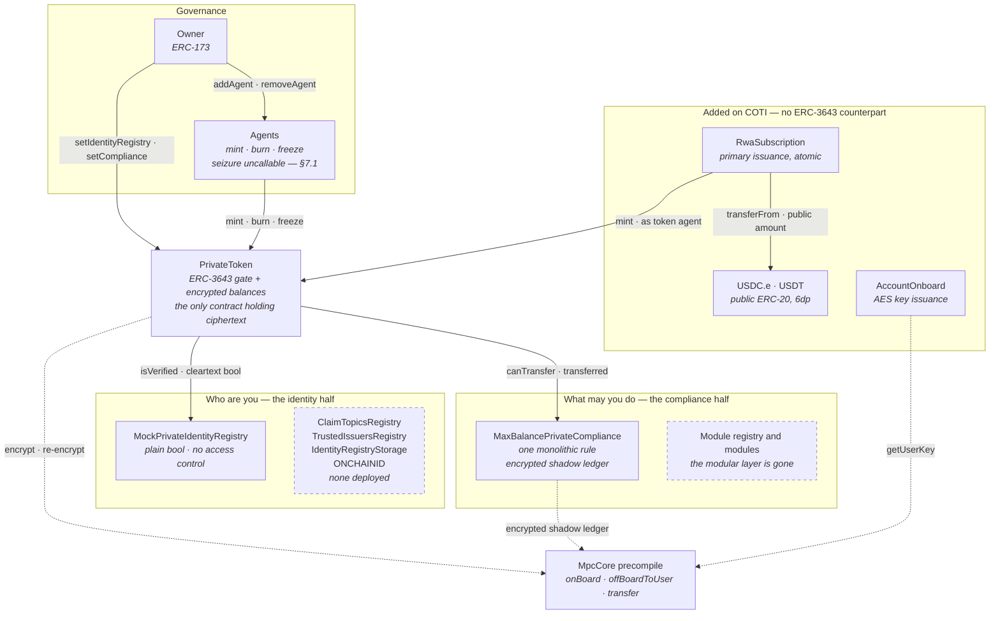

# What this repository changes in ERC-3643

Read [`ERC-3643-STANDARD.md`](ERC-3643-STANDARD.md) first. This document assumes it, and
describes only the delta: what the COTI port adds to ERC-3643 v4.1.3, what it removes,
and what it breaks.

**Nothing here is audited.** Two of the changes below are silent failures that present a
correct-looking ABI while meaning something else — §7 is the section to read before any
integration work.

Verified against the working tree and against COTI testnet (chain `7082400`) on
20 September 2026.

---

## 1. What is in the repository

```
app/                            React + wagmi front end (the part a person can be shown)
private-ERC-3643-coti-port/
  README.md                     engineering record: phases, deploy log, chain verification
  tree/                         the fork itself — contracts, tests, scripts, deployments
```

`app/src/data/deployment.json` is a copy of
`private-ERC-3643-coti-port/tree/deployments/rwa-demo.json`. **They must stay identical**
or the site points at the wrong contracts. They are in sync as of 20 September 2026.

## 2. The contracts

Laid out to match [`ERC-3643-STANDARD.md`](ERC-3643-STANDARD.md) §2, so the standard and
this port can be read side by side. Every address links to cotiscan on COTI testnet
(chain `7082400`).

| ERC-3643 component | In this port | JTRSY | JAAA |
| --- | --- | --- | --- |
| `Token` | `PrivateToken` — encrypted balances, 8dp | [`0x6D7cf587…Baf3`](https://testnet.cotiscan.io/address/0x6D7cf587dbF68eb233B7BEd1f45BDfB6aE31Baf3) | [`0x20b2C3cc…6732`](https://testnet.cotiscan.io/address/0x20b2C3cc4F7b4a5f727b1aa69779aD9C20036732) |
| `IdentityRegistry` | `MockPrivateIdentityRegistry` — **a stub** (§5) | [`0x9Da490af…5F37`](https://testnet.cotiscan.io/address/0x9Da490afb22cEb1B8aA82d2EC4418BB4A62e5F37) | [`0xC64DC851…a23E`](https://testnet.cotiscan.io/address/0xC64DC85109E823380ea4DE34b6ac1B22a02Ba23E) |
| `IdentityRegistryStorage` | **absent** | — | — |
| `ClaimTopicsRegistry` | **absent** | — | — |
| `TrustedIssuersRegistry` | **absent** | — | — |
| `ModularCompliance` | `MaxBalancePrivateCompliance` — **monolithic** (§4.4) | [`0xB5d2e888…28CB`](https://testnet.cotiscan.io/address/0xB5d2e8880005dCF84f13Fc58626d7F67734E28CB) | [`0x2abfd119…a531`](https://testnet.cotiscan.io/address/0x2abfd1194120fb2BDc2D3Fd8366C2979c7aea531) |
| **ONCHAINID** | **absent** | — | — |
| *no counterpart* | `RwaSubscription` — primary issuance (§6) | [`0x5cf23F0c…A98f`](https://testnet.cotiscan.io/address/0x5cf23F0cf6369477d1F267e5f9F281C3e6B8A98f) | [`0x0A1089dc…1bf9`](https://testnet.cotiscan.io/address/0x0A1089dc8b71E463c3AD89363058B5a07A7f1bf9) |

Shared by both funds, deployed once:

| Contract | Address | Note |
| --- | --- | --- |
| `AccountOnboard` | [`0x68603585…C825`](https://testnet.cotiscan.io/address/0x686035856C60D73843C839ad50eDC6c40385C825) | AES key issuance. The front end does not use it (§6) |
| `USDC.e` | [`0x63f3D2Cc…D19C`](https://testnet.cotiscan.io/address/0x63f3D2Cc8F5608F57ce6E5Aa3590A2Beb428D19C) | Pre-existing testnet token. **Ordinary public ERC-20**, 6dp |
| `USDT` | [`0x9e961430…3Cf0`](https://testnet.cotiscan.io/address/0x9e961430053cd5AbB3b060544cEcCec848693Cf0) | Pre-existing testnet token. **Ordinary public ERC-20**, 6dp |

Read against the standard's seven components: **one is ported** (`Token` →
`PrivateToken`), **two are degraded** (the registry to a stub, compliance to a single
monolithic rule), **four are absent entirely** — the two claim registries, the registry
storage layer and ONCHAINID — and **one contract is added** that the standard has no
counterpart for. The four absences are the whole identity half of ERC-3643, which is why
§5 exists.

### How they fit together

The same shape as the standard's diagram, with what is missing drawn in rather than
omitted. Dashed boxes are **not deployed**.



Three differences from the standard's picture are worth naming:

- **The identity half collapsed to one box.** In the standard, `IdentityRegistry` fans out
  to three registries and an investor-owned ONCHAINID. Here it terminates in a stored
  boolean, and nothing fans out at all.
- **The compliance half has no modules.** `MaxBalancePrivateCompliance` *is* the rulebook,
  not a binder of rules (§4.4).
- **Two edges are new and both are public.** `RwaSubscription` pulling a plain ERC-20, and
  the subscription minting as a token agent — the atomic-settlement gain and the
  public-payment-leg cost, in one path (§6).

### The port is purely additive

The single most useful fact about this fork, and it is mechanically checkable:

```sh
npm pack @erc3643org/erc-3643@4.1.3 && tar xzf erc3643org-erc-3643-4.1.3.tgz
diff -rq package/contracts private-ERC-3643-coti-port/tree/contracts
```

**All 66 upstream `.sol` files are byte-identical.** Not one line of ERC-3643 v4.1.3 was
edited. `diff` reports only additions:

| Added path | Files | Lines | What it is |
| --- | --- | --- | --- |
| `contracts/bubble/` | 3 | 14,760 | Vendored COTI `MpcCore`, `MpcInterface`, `DecryptionCaller` |
| `contracts/token/PrivateToken.sol` | 1 | 1,082 | The confidential token, beside untouched `Token.sol` (595) |
| `contracts/token/PrivateTokenStorage.sol` | 1 | 145 | Its storage layout |
| `contracts/token/IPrivateToken.sol` | 1 | 471 | Its interface, beside untouched `IToken.sol` (460) |
| `contracts/compliance/modular/IPrivateModularCompliance.sol` | 1 | 234 | Compliance interface with encrypted `canTransfer` |
| `contracts/registry/interface/IPrivateIdentity*.sol` | 2 | 17 | Minimal identity interfaces |
| `contracts/roles/private/` | 2 | 58 | `AgentRoleUpgradeable`, `Roles` |
| `contracts-private/` | 5 | 356 | Demo and test contracts — outside the fork tree entirely |

The private stack **sits beside** the plaintext one rather than replacing it. A reviewer
who knows T-REX can diff this tree against upstream and get a clean, empty answer for
every file they already trust.

### The vendored MPC library is one commit behind upstream

`contracts/bubble/MpcCore.sol` was vendored from
[`coti-io/coti-contracts`](https://github.com/coti-io/coti-contracts). Against upstream
`main` today it differs by **exactly one line**:

```solidity
function transferWithAllowance(gtUint128 a, gtUint8 b, gtUint8 amount, gtUint32 allowance) ...
    // M-32: allowance tag must be SUINT32_T to match gtUint32.unwrap(allowance).
-   ... MPC_TYPE.SUINT8_T,  ARGS.BOTH_SECRET), ...   // this tree
+   ... MPC_TYPE.SUINT32_T, ARGS.BOTH_SECRET), ...   // upstream main
```

An audit fix (tagged `M-32`) landed upstream after this tree was vendored: a mismatched
type tag in one mixed-width `transferWithAllowance` overload.

**Scope: it does not affect this port.** `PrivateToken` never calls
`transferWithAllowance` — its only MPC transfer call site is
`MpcCore.transfer(gtUint256, gtUint256, gtUint256)` at
[`PrivateToken.sol:982`](private-ERC-3643-coti-port/tree/contracts/token/PrivateToken.sol#L982),
and the affected overload is 128/8/8/32. But the vendored copy is no longer the upstream
copy, and re-vendoring should be a deliberate step with the diff re-checked, not a silent
refresh.

## 3. The type changes

| Surface | Plaintext T-REX | This port |
| --- | --- | --- |
| Balances, allowances, frozen tokens | `uint256` | **`utUint256` / `ctUint256` ciphertext in storage** |
| Total supply | `uint256` | `uint256` — **stays public** |
| Identity registry | `isVerified`, `investorCountry` | **unchanged, cleartext** — `bool` and `uint16` |
| `canTransfer` | `view returns (bool)` | **non-`view`, `returns (gtBool)`** |
| Failed transfer | `revert("Transfer not possible")` | **never reverts** — moves an encrypted zero |
| Mint / burn | synchronous | **async** — decrypt request plus `callbackMint` / `callbackBurn` |
| Compliance modules | framework + 11 in the archived repo | **one monolithic contract**, marked test-only |
| `version()` | `"4.1.3"` | `"0.0.1"` |

Three COTI types carry the whole design, and the distinction between them is what most of
the port is about:

- **`gtUint256`** — a *garbled handle*. Live only **inside one transaction**. It can be
  passed between contracts in the same call, and it cannot be stored or returned to a
  caller.
- **`ctUint256`** — a *ciphertext*, readable by **exactly one** holder of an AES key.
  This is what goes in storage and what a user decrypts off-chain.
- **`itUint256`** — an *input* ciphertext plus a signature binding it to the sender and
  the function selector. This is how a user supplies an encrypted amount.

## 4. The five structural changes

### 4.1 Read access is granted at write time

COTI has no runtime permit model — no `permit`, `permitThis`, `permitTransient`. There is
no way to hold an encrypted value and decide later who may read it. Every write is instead
an `offBoardToUser(gt, addr)` naming its reader.

The upstream original had 61 `permit` call sites. **There are now none** — the only remaining
occurrences of the word in `PrivateToken.sol` are seven comments explaining what replaced
it. Each one became an explicit decision about *whom to encrypt to*, which is the single
largest piece of work in the port and also the more auditable model: read access is
visible in the code that writes the value.

The consequence is an **eager multi-copy write**. A balance is a `utUint256` —
`{ contract copy, holder copy }` — written through `MpcCore.offBoardCombined`. An
allowance needs three ciphertexts, because owner and spender must each read it:

```solidity
struct PrivateAllowance {
    ctUint256 ciphertext;          // contract copy — the source of truth
    ctUint256 ownerCiphertext;
    ctUint256 spenderCiphertext;
}
```

**Agents are the case this model cannot pre-compute.** The agent set is a role and
therefore unbounded, so no eager slot can exist for it. Instead an agent calls
`reencryptFrozenTokens(holder)` and reads its own copy back from
`_frozenTokensForReader[reader][holder]`. That works for the *frozen* amount. **A
supervisor who needs to read a holder's actual balance has no path at all** — an open gap,
not an oversight.

### 4.2 Storage holds ciphertext, not handles

The upstream design kept long-lived `gtUint256` handles in storage. On COTI a handle cannot
survive a transaction boundary, so balances became `utUint256`, on-boarded at the top of
each transaction and off-boarded at the end. This touched every storage read and write in
the token and in the compliance module.

The canonical encrypted zero shows the shape of the change — it used to be a stored
handle, and is now minted per call:

```solidity
/// @dev Retained to preserve the storage layout.
uint256 internal _mpcZeroBalanceHandleDeprecated;
```

The `__gap` is correspondingly reduced from 45 to 43 slots for
`_frozenTokensForReader` and `_accountEncryptionAddress`.

### 4.3 Decryption is synchronous, which *removes* machinery

`MpcCore.decrypt(gtUint256) returns (uint256)` returns in-transaction. The upstream async
decrypt apparatus — request mappings, batch-burn user lists, relayer callbacks — collapses
into inline calls, and `MintRequested` / `MintFinalized` fire in the **same transaction**.

The async remnants that survive (`_burnRequests`, `_mintRequests`, `_batchBurnUsers`,
`callbackMint`, `callbackBurn`) exist for one reason only: **`_totalSupply` is a public
`uint256`**. Burning an encrypted amount requires learning how much was actually burned in
order to keep the public figure honest.

**The asynchrony is a consequence of a design choice, not of the cryptography.** Keep
supply encrypted — as COTI's own `PrivateERC20` does — and the whole apparatus disappears.

### 4.4 Modular compliance is collapsed, not ported

This is the largest functional gap and it is understated by the phrase "one module of
eleven".

`IPrivateModularCompliance` still *declares* the modular surface —
`addModule`, `removeModule`, `callModuleFunction`, `getModules`, `isModuleBound`. But the
deployed contract, `MaxBalancePrivateCompliance`, is declared as:

```solidity
contract MaxBalancePrivateCompliance is Ownable {
```

It does **not** implement that interface. It implements the six functions the token
actually calls — `bindToken`, `unbindToken`, `canTransfer`, `transferred`, `created`,
`destroyed` — and nothing else. There is no module registry, no `addModule`, no
`moduleCheck`. **The modular layer is gone**, replaced by a single monolithic rule.
`getModules()` on the deployed funds is not "empty", it is absent.

What the one rule does prove is the hard part. `MaxBalancePrivateCompliance` keeps
`_trackedBalancePrivate`, an **encrypted shadow ledger** parallel to the token's — the
second ledger `MaxBalanceModule` keeps per ONCHAINID, which must stay consistent with the
token's under encryption. It works, with `checkedSubWithOverflowBit` and `mux` standing in
for the branches a plaintext module would take. The dual-ledger problem is solved in
practice, not only on paper.

What is not attempted: the four rolling accumulators (`TimeTransfersLimits`,
`ExchangeMonthlyLimits`, …) and the fee-derived nested transfer (`TransferFees`) — the
genuinely hard items.

### 4.5 Failure became silent

`transfer` returns `gtBool`, and a blocked transfer moves an **encrypted zero** rather
than reverting:

```solidity
gtUint256 transferredAmount = MpcCore.mux(_canTransfer, _zero(), _amount);
```

This is necessary — a revert would leak the compliance outcome in cleartext — and it is
the deepest break with ERC-20. **A transaction can succeed on-chain while transferring
nothing**, and the caller cannot tell which happened without decrypting the result. Every
integrator downstream of such a token has to be rewritten to check a ciphertext instead of
a revert.

The test suite pins this: an unverified recipient, an over-cap transfer and an
over-balance transfer all move an encrypted zero without reverting, and the free-balance
boundary is exact — freeze 400 of 1,000, and 600 passes while 601 blocks.

## 5. The identity registry is a mock

The deployed registry is `MockPrivateIdentityRegistry` — six functions over three plain
mappings:

```solidity
mapping(address => bool) public verified;
function setVerified(address _userAddress, bool _isVerified) external { ... }
```

Against the standard's `IdentityRegistry`: no ONCHAINID, no `ClaimTopicsRegistry`, no
`TrustedIssuersRegistry`, no claim walk, no `isClaimValid` callback. Verification is a
stored boolean, and **`setVerified`, `registerIdentity` and `deleteIdentity` carry no
access control whatsoever** — anyone can verify anyone.

For a demo that is the point; the flow is meant to be drivable. For anything else it means
**the identity half of ERC-3643 is not implemented in this repository at all**. That half
is, per §8 of the standard doc, the standard's strongest claim. Note also that the
registry stays **cleartext by design** — `isVerified` returns a plain `bool` and
`investorCountry` a plain `uint16`. Confidentiality here covers amounts, not eligibility.

## 6. Two contracts with no ERC-3643 counterpart

**`RwaSubscription`** (109 lines) — a primary-issuance till. An investor calls
`subscribe(paymentToken, amount)`; the stablecoin leg settles to the treasury and the
encrypted shares mint **in one atomic transaction**. T-REX has no counterpart because
issuance is assumed to happen off-chain: on Avalanche the entire DMF supply arrived in two
agent `batchMint` calls with no payment leg on-chain at all. Removing that counterparty
risk is a genuine improvement on the incumbent flow.

It comes with a disclosure attached, which the contract documents itself:

> PRIVACY NOTE, deliberately not hidden: USDC and USDT on COTI testnet are ordinary
> ERC-20s with public amounts. The payment leg of a subscription is therefore visible,
> and because the price is public the share count follows from it.

**Confidentiality protects the holding, not the purchase.** Confirmed on chain: in
`0x8ffe8404…df788` the `Subscribed` event carries `paymentAmount = 100000000` and
`shares = 8989256939` as plain integers. The encrypted `Transfer` protects the position
from then on; it does not protect its acquisition. Closing this needs a confidential
payment token or off-chain settlement.

**`AccountOnboard`** (23 lines) — verbatim from `coti-io/coti-contracts` with the import
repointed, so each test signer can obtain its own AES key. Deployed for completeness; the
front end does **not** use it, because onboarding is owned by the COTI wallet plugin, which
ships its own.

## 7. Integration traps

Both of these present a correct-looking interface and mean something else. A missing
function fails loudly; these do not.

### 7.1 Four functions are ABI-identical and semantically incompatible

`type gtUint256 is uint256` is a user-defined value type and therefore **invisible in an
ABI**. These four take `gtUint256`:

```
forcedTransfer(address,address,uint256)
batchForcedTransfer(address[],address[],uint256[])
batchFreezePartialTokens(address[],uint256[])
batchUnfreezePartialTokens(address[],uint256[])
```

They present an **exact signature match** to any ERC-3643 tooling, which will encode a
plaintext amount that the contract reads as a garbled handle. A handle cannot survive a
transaction boundary, so these are **uncallable from outside**. Agent seizure and batch
freezing do not work and need `itUint256` parameters. Two tests pin the behaviour.

The eight functions that were converted correctly take `itUint256`: `transfer`,
`transferFrom`, `approve`, `increaseAllowance`, `decreaseAllowance`, `batchTransfer`,
`freezePartialTokens`, `unfreezePartialTokens`.

### 7.2 The token is invisible to ERC-20 infrastructure

`PrivateToken` exposes 58 functions and 21 events. Three failure modes, and two are
silent:

- **`transfer`, `transferFrom`, `approve` change selector.** An ERC-20 client's call
  reverts — loud, and nobody loses anything to a misunderstanding.
- **`balanceOf` and `allowance` keep their selectors** while returning 64 bytes instead of
  32. A client decoding the first word reads `ciphertextHigh` and displays a plausible,
  enormous, meaningless balance. Confirmed against ethers v6, which does not throw on the
  extra word. MetaMask's "import token" fails this way.
- **`Transfer` and `Approval` carry a different `topic0`.** No indexer, explorer or
  subgraph matches a single log, and **the token appears to have no activity whatsoever**.
  That is the failure most easily mistaken for "the transaction didn't work".

Reading a balance therefore means: call `balanceOf(address)` with the tuple ABI, take the
`ctUint256`, and decrypt it off-chain with the holder's AES key.

```
function balanceOf(address) view returns (tuple(uint256 ciphertextHigh, uint256 ciphertextLow))
```

This is the same shape as COTI's own `PrivateERC20`, so the COTI wallet plugin's
`version: 256` path reads it unmodified — pass `decimals: 8`. One difference from the
standard pToken: this contract has **no `accountEncryptionAddress(address)` getter**, only
the setter. Tooling that reads the off-board target will fail against it.

## 8. What is deployed

COTI testnet, chain `7082400`. Deployed 10 August 2026 by
[`scripts/deploy-rwa-demo.ts`](private-ERC-3643-coti-port/tree/scripts/deploy-rwa-demo.ts),
recorded in `deployments/rwa-demo.json`. Two funds, four contracts each, plus one shared
`AccountOnboard`. §2 shows the same addresses mapped onto their ERC-3643 roles; this is
the deployment record.

### The demo fund stack

| Contract | JTRSY — Janus Henderson Treasury Fund | JAAA — Janus Henderson AAA CLO Fund |
| --- | --- | --- |
| `PrivateToken` | [`0x6D7cf587dbF68eb233B7BEd1f45BDfB6aE31Baf3`](https://testnet.cotiscan.io/address/0x6D7cf587dbF68eb233B7BEd1f45BDfB6aE31Baf3) | [`0x20b2C3cc4F7b4a5f727b1aa69779aD9C20036732`](https://testnet.cotiscan.io/address/0x20b2C3cc4F7b4a5f727b1aa69779aD9C20036732) |
| `MockPrivateIdentityRegistry` | [`0x9Da490afb22cEb1B8aA82d2EC4418BB4A62e5F37`](https://testnet.cotiscan.io/address/0x9Da490afb22cEb1B8aA82d2EC4418BB4A62e5F37) | [`0xC64DC85109E823380ea4DE34b6ac1B22a02Ba23E`](https://testnet.cotiscan.io/address/0xC64DC85109E823380ea4DE34b6ac1B22a02Ba23E) |
| `MaxBalancePrivateCompliance` | [`0xB5d2e8880005dCF84f13Fc58626d7F67734E28CB`](https://testnet.cotiscan.io/address/0xB5d2e8880005dCF84f13Fc58626d7F67734E28CB) | [`0x2abfd1194120fb2BDc2D3Fd8366C2979c7aea531`](https://testnet.cotiscan.io/address/0x2abfd1194120fb2BDc2D3Fd8366C2979c7aea531) |
| `RwaSubscription` | [`0x5cf23F0cf6369477d1F267e5f9F281C3e6B8A98f`](https://testnet.cotiscan.io/address/0x5cf23F0cf6369477d1F267e5f9F281C3e6B8A98f) | [`0x0A1089dc8b71E463c3AD89363058B5a07A7f1bf9`](https://testnet.cotiscan.io/address/0x0A1089dc8b71E463c3AD89363058B5a07A7f1bf9) |
| Share price | 1.112439 | 1.044450 |

Shares are 8dp.

### Shared contracts

| Contract | Address | Note |
| --- | --- | --- |
| `AccountOnboard` | [`0x686035856C60D73843C839ad50eDC6c40385C825`](https://testnet.cotiscan.io/address/0x686035856C60D73843C839ad50eDC6c40385C825) | AES key issuance; the front end does not use it (§6) |
| `USDC.e` | [`0x63f3D2Cc8F5608F57ce6E5Aa3590A2Beb428D19C`](https://testnet.cotiscan.io/address/0x63f3D2Cc8F5608F57ce6E5Aa3590A2Beb428D19C) | Pre-existing testnet token. **Ordinary public ERC-20**, 6dp |
| `USDT` | [`0x9e961430053cd5AbB3b060544cEcCec848693Cf0`](https://testnet.cotiscan.io/address/0x9e961430053cd5AbB3b060544cEcCec848693Cf0) | Pre-existing testnet token. **Ordinary public ERC-20**, 6dp |

**These are demo tokens.** The real JTRSY is a Centrifuge V3 / ERC-7540 fund on Ethereum
mainnet and has no COTI deployment. Nothing here is affiliated with Janus Henderson or
Anemoy.

All nine contracts are source-verified on cotiscan with a full bytecode match
(`0.8.25`, `viaIR`, `paris`, 200 runs). **`evmVersion` must be `paris`** — COTI rejects
Shanghai `PUSH0`, and this tree compiled for `cancun` through early phases and would never
have deployed.

### The test-suite deployment — do not confuse it with the demo stack

A separate, bare stack deployed 9 August 2026 and recorded in
`deployments/coti-testnet.json`. It has no subscription layer, is **not source-verified**,
and **nothing consumes it** — it exists because the 60 tests run against it.

| Contract | Address |
| --- | --- |
| `PrivateToken` | [`0xa885398494fB02916C1AeC8Bd31DD7d1a0694Bd7`](https://testnet.cotiscan.io/address/0xa885398494fB02916C1AeC8Bd31DD7d1a0694Bd7) |
| `MaxBalancePrivateCompliance` | [`0xc3b5F4eFe6954EC39598D83b5Ea033273eefB917`](https://testnet.cotiscan.io/address/0xc3b5F4eFe6954EC39598D83b5Ea033273eefB917) |
| `MockPrivateIdentityRegistry` | [`0x05f99994eF7E27792C36353065A6E12Ba9f2bEF7`](https://testnet.cotiscan.io/address/0x05f99994eF7E27792C36353065A6E12Ba9f2bEF7) |

Note that `scripts/verify-deployment.ts` reads this file, so it checks **only** this stack
— it does not look at the demo contracts the application uses.

### Confidentiality round-trips, confirmed

Read live on 18 September 2026: the JTRSY holder ciphertext decrypts to `197763652658`
(1977.63652658 shares) against a public `totalSupply` of `198213115504`. The value is
readable by its owner and by nobody else, and the public figure reconciles.

## 9. The application

`app/` — React 18, Vite, wagmi 2, viem, RainbowKit, `@coti-io/coti-wallet-plugin@0.3.9`.

A person connects a wallet, signs once so the plugin derives their AES key, subscribes
with USDC.e or USDT, and reads their share balance — a `ctUint256` fetched from chain and
decrypted **in their own browser** with a key that never leaves the device. Locked, the
balance renders blurred rather than absent, which is the accurate depiction: the value is
on-chain and unreadable.

## 10. What is not done

- **Identity is a mock** (§5) — no ONCHAINID, no claims, no access control.
- **Ten of eleven compliance modules are unported**, and the modular layer itself is
  collapsed (§4.4). The rolling accumulators and fee-derived nested transfer are not
  attempted.
- **Four agent entry points are uncallable** and need `itUint256` (§7.1).
- **Agents cannot read balances** — only frozen amounts, via `reencryptFrozenTokens`
  (§4.1).
- **The subscription payment leg is public** (§6).
- **Nothing is audited.** 823k gas for one mint is a data point, not a cost model.
- **Bytecode headroom is thin** — 22,309 of 24,576 bytes under Paris, ~2.3 KB left. More
  compliance will need library extraction.
- The two original upstream suites were **rewritten against the ct model** rather than
  repointed, because they assumed durable `gtUint256` handles in storage. Every original
  test intent is preserved, including four asserting the `gtUint256` entry points are
  unreachable.

Sixty passing tests on a testnet are not a pilot.

## 11. Building and running

```sh
cd private-ERC-3643-coti-port/tree && npm install

# The RWA demo stack. Rewrites deployments/rwa-demo.json — copy it to
# app/src/data/deployment.json afterwards or the site keeps the old addresses.
npx hardhat run scripts/deploy-rwa-demo.ts --config hardhat.private.config.ts --network coti-testnet

# 60 tests, against a live node — there is no local MPC simulator
npx hardhat test test/token/private-token-coti.tests.ts                   --config hardhat.private.config.ts --network coti-testnet
npx hardhat test test/token/private-token-coti-allowances.tests.ts        --config hardhat.private.config.ts --network coti-testnet
npx hardhat test test/token/private-token-transfer.tests.ts               --config hardhat.private.config.ts --network coti-testnet
npx hardhat test test/token/private-token-max-balance-compliance.tests.ts --config hardhat.private.config.ts --network coti-testnet
```

`testnet.coti.io` returns 502 on roughly half of all requests. Run the retrying proxy
first or no run will finish:

```sh
node scripts/rpc-retry-proxy.js &
COTI_TESTNET_RPC_URL=http://127.0.0.1:8545 npx hardhat test ... --network coti-testnet
```

Every test result is real garbled-circuit execution against the live precompile, never a
mock.

---

**License.** The fork inherits **GPL-3.0** from ERC-3643. `contracts-private/` and `app/`
are MIT-headered, but they import and link GPL-3.0 code — treat the deployed stack as
GPL-3.0.
