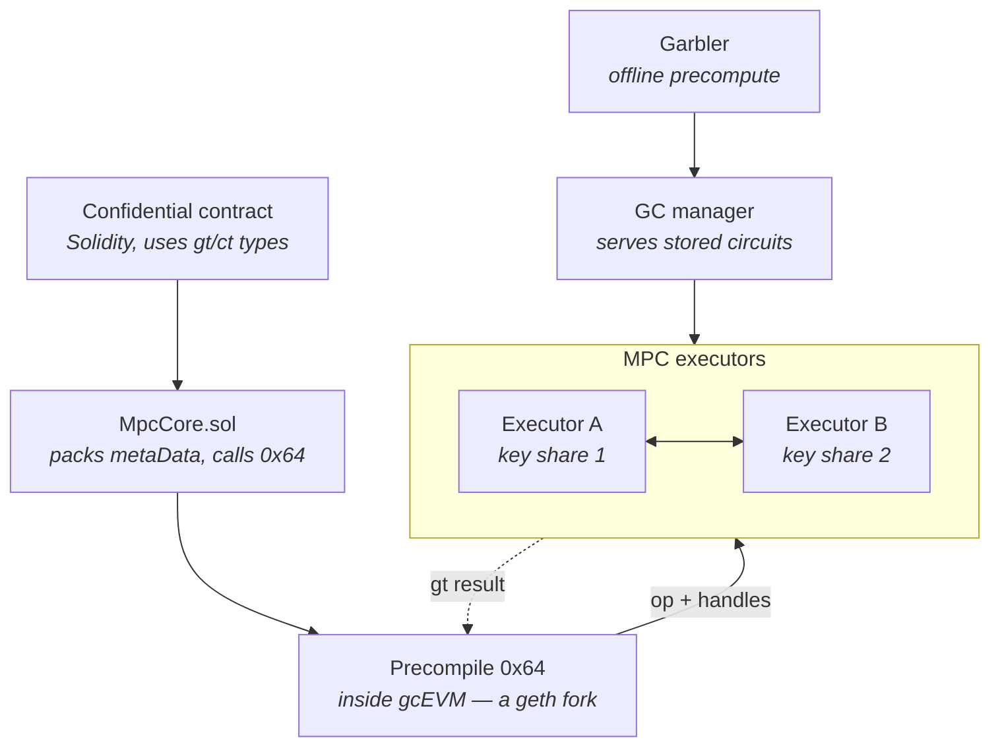

# COTI vs Zama: the two confidential ERC-3643s

A short decision brief. Both implementations exist, both run on a testnet, and the difference
between them is decidable from evidence. Sources: [`Private_RWAs.md` Addendum VIII](Private_RWAs.md#addendum-viii-the-two-confidential-erc-3643s-side-by-side),
[`coti_rwa.md`](coti_rwa.md), [`workplan.md` B7](workplan.md).

## The evidence is asymmetric, and that colours everything below

|  | COTI | Zama |
| --- | --- | --- |
| Source | Published — [`repos/private-ERC-3643-coti-port/`](repos/private-ERC-3643-coti-port/) | `github.com/tokeny/confidential-token` → **404** |
| Verification | 60 tests against a live node; nine contracts source-verified on cotiscan, full bytecode match | None possible |
| What we actually read | The code and the deployed contracts | A **57-function ABI** pulled from the front-end bundle, plus RPC probes |

Everything asserted about Zama is **ABI-level and behavioural**. Signatures and types are exact;
semantics are inferred. Re-derive from source if Tokeny ever publishes.

## The architectural split

**COTI encrypts in place.** `PrivateToken` *is* the ERC-3643 token. Balances are `ctUint256`,
compliance evaluates on ciphertext inside the transfer, and there is one token.

**Zama wraps.** An ERC-7984 confidential token takes `constructor(IToken erc3643Token_)`, holds the
T-REX token and issues a parallel encrypted balance. Two tokens, with a `wrap`/`unwrap` boundary.

### The cryptography underneath is also different

Both get called "confidential", but they are not two brands of one primitive.

**Zama is FHE.** The ciphertext *is* the computable object: it persists, anyone holding it plus an
evaluation key computes on it non-interactively, and confidentiality reduces to a lattice hardness
assumption. Amounts are `euint64` handles pointing at values held by an FHE coprocessor, with
decryption thresholded across a KMS.

**COTI is garbled circuits.** Not an encryption scheme but a protocol — the evaluator decrypts a row
of a garbled truth table at every gate and never learns which plaintext a wire label carries, and a
garbled circuit is single-use. Confidentiality rests on the computing parties **not colluding**.

That shows up directly in the types. COTI needs two where FHE needs one:

|  | COTI | Zama |
| --- | --- | --- |
| Computed on | `gtUint256` — a garbled handle, live only inside one transaction | the ciphertext itself |
| Stored and read | `ctUint256` — an AES ciphertext with exactly one reader | the same ciphertext |

Under FHE the ciphertext persists because it is what you compute on. On COTI the computable form
cannot cross a transaction boundary, so every write calls `offBoardToUser` to name a reader and
convert compute-form into storage-form.

### How COTI's garbled circuits actually execute

Worth drawing, because the shape of this picture *is* advantages 3 and 4 rather than a claim about
them.



Following one operation down and back:

1. **The contract is ordinary Solidity.** It declares `gtUint256` and `ctUint256` and calls
   `MpcCore.add`, `mux`, `transfer`. No new language, no circuit to write.
2. **`MpcCore.sol` is a library, not a service.** It packs a `bytes3`/`bytes5` tag naming each
   operand's type and whether it is secret — `combineEnumsToBytes3(SUINT256_T, SUINT256_T, BOTH_SECRET)`
   — then calls `ExtendedOperations(address(MPC_PRECOMPILE)).Add(metaData, lhs, rhs)` with the
   operands as bare `uint256` handles.
3. **`0x64` is not a contract.** `MpcInterface.sol:48` fixes `MPC_PRECOMPILE` at
   `0x…0064`, a precompile compiled into **gcEVM**, COTI's geth fork. The MPC lives *in the node*,
   in the execution path.
4. **The executors do the work.** The precompile passes the opcode and handles to executors holding
   **key shares**, which run the garbled-circuit protocol between them. Neither sees a plaintext
   operand; neither alone can reconstruct one.
5. **The circuits were garbled in advance.** A garbler precomputes them offline and a GC manager
   serves them at execution time, so per-operation cost is lookup and evaluation rather than
   generation.
6. **The result returns as a `gt` handle to the same call**, which is why `MpcCore.decrypt` can
   return in-transaction at all.

Two consequences read straight off it. **Everything but the garbler pair sits inside the node** —
there is no relayer, no gateway chain, no KMS in the live path, which is advantage 3 stated as
topology. And **the return arrow closes inside the transaction**, which is advantage 4.

The trust boundary is the executor set: confidentiality holds while key-share holders do not
collude. Zama's equivalent boundary is the KMS threshold. That is the same question asked of two
different sets of operators, and it is the one an institutional reviewer should ask of either.

### What the encryption actually is: keys, size, strength, time

The section above is topology. This one is the primitives, because "both are confidential" hides
four differences an institutional reviewer will ask about separately.

**The evidence here is better than elsewhere in this document.** Tokeny's *wrapper* is still a 404,
but Zama's *platform* is published, and a checkout of it sits in `research/fhevm/`. Every Zama fact
below is read from that source, not inferred from an ABI. COTI's side is read from the vendored
`MpcCore.sol` and from `coti-sdk-typescript`. Only the latency and off-chain-size figures are
estimates, and they are marked as such.

#### Keys and algorithms

|  | COTI | Zama |
| --- | --- | --- |
| Scheme protecting stored data | **AES-128**, as a randomised pad | **TFHE** — lattice, via [TFHE-rs](https://github.com/zama-ai/tfhe-rs) |
| Parameter set | — (AES is the whole of it) | `V1_5_META_PARAM_CPU_2_2_KS_PBS_PKE_TO_SMALL_ZKV2_TUNIFORM_2M128` |
| The holder's key | one **128-bit AES key**, derived from a single wallet signature | **none** — no per-user FHE key exists |
| Who can decrypt alone | the holder | **nobody**; decryption is a threshold protocol across the TKMS parties |
| The key that computes | executor **key shares**, garbled-circuit protocol | a **public bootstrap key**, held by every coprocessor |
| Can the compute key decrypt? | no — a share alone reconstructs nothing | no — "the bootstrap key itself does not allow any FHEVM node to decrypt" |

Sources: `crypto_utils.ts:437-455`, `aesKey.ts` (*"expected 32 hex characters (128-bit)"*),
`fhevm-engine-common/src/keys.rs:6`, `coprocessor/docs/fundamentals/overview.md:21,37`.

#### The COTI ciphertext, exactly

Worth spelling out, because "AES" alone would misdescribe it
([`crypto_utils.ts:11-36`](https://github.com/coti-io/coti-sdk-typescript)):

```
r  ← 16 random bytes                    // fresh per value, per write
ct ← AES-ECB(key, r)  XOR  plaintext    // plaintext zero-padded to 16 bytes
stored: (ct ‖ r) = 32 bytes per 128-bit block
```

**`AES-ECB` appears in that code and it is not the weakness it looks like.** The cipher is never
applied to plaintext — it is applied to a fresh random block `r`, and the result is used as a
one-time pad. No plaintext block ever enters the cipher, so ECB's pattern leak cannot arise. It is
a pad generator, not a mode over data, and `r` is stored alongside so the holder can regenerate the
pad. The cost is that the ciphertext carries its own randomness: **2× expansion, always.**

A 256-bit value is two such blocks — `struct ctUint256 { ctUint128 ciphertextHigh; ctUint128
ciphertextLow; }` ([`MpcCore.sol:49`](private-ERC-3643-coti-port/tree/contracts/bubble/MpcCore.sol)) —
which is exactly why `balanceOf` returns 64 bytes and breaks every ERC-20 client that reads 32
([`MPC-CONFIDENTAL-IMPLEMENTATION.md`](MPC-CONFIDENTAL-IMPLEMENTATION.md) §7.2).

#### Size — and why "smaller on chain" is not "smaller"

|  | COTI | Zama |
| --- | --- | --- |
| On-chain, per encrypted balance | **64 bytes** — `ctUint256`, two × (16B pad ‖ 16B `r`) | **32 bytes** — `HANDLE_LEN = 32` |
| What those bytes *are* | **the ciphertext itself** | **a pointer.** The ciphertext is not on chain |
| Where the real ciphertext lives | on chain, in the storage slot | off-chain, in the coprocessor's database |
| True ciphertext size | 64 bytes | **kilobytes** — TFHE ciphertext (estimate) |
| Expansion over plaintext | **2×** | ~3 orders of magnitude (estimate) |
| What a user submits | `itUint256` — ciphertext **+ a signature** | `externalEuint64` **+ a ZK proof of knowledge** |

`HANDLE_LEN` is at `fhevm-engine-common/src/types.rs:1014`. The row that matters is the second:
COTI's 64 bytes is the entire protected object, so a COTI chain carries its own confidentiality in
state. Zama's 32 bytes is a handle, and **losing the coprocessor's database loses the balances** —
the chain alone does not contain them. That is a different durability story, not merely a different
byte count, and it is the one an issuer's operations team should be asked about.

#### Cryptographic strength — two assumptions each, and they are not the same two

|  | COTI | Zama |
| --- | --- | --- |
| Data **at rest** reduces to | AES-128 — standard, 128-bit symmetric | LWE/GLWE lattice hardness, 128-bit target |
| Data **under computation** reduces to | **executors not colluding** — a trust assumption, not a hardness one | the same lattice assumption |
| **Decryption** is gated by | possession of the holder's AES key | **threshold** agreement among TKMS parties |
| Failure mode | executor collusion exposes values in those sessions | threshold breach exposes **everything ever encrypted** under that key |
| Post-quantum | **AES-128 → ~64-bit under Grover** | lattice — believed PQ-secure |

Two honest readings, and they point opposite ways.

**In COTI's favour: the blast radius is bounded.** Garbled circuits are single-use and key shares
are per-session, so a collusion event compromises what it touched. Zama's secret FHE key is
long-lived and global — a threshold breach is **retroactive over the whole history**.

**In Zama's favour: one of COTI's two assumptions is not cryptographic at all.** "The executors do
not collude" is an operational claim about who runs the nodes. Lattice hardness is a mathematical
one. A reviewer who weighs assumptions by kind, not by count, will prefer the latter — and will
also note the post-quantum row, where AES-128's effective margin halves under Grover while TFHE is
one of the schemes chosen *because* it is lattice-based.

#### Time

**No benchmark was run for this document**, and the figures below are internal estimates from
`gcevm_vs_fhevm/PrivateERC20_vs_ERC7984_Comparison.md` (outside this repo),
not measurements. What *is* verified is the shape, and the shape is the finding:

|  | COTI | Zama |
| --- | --- | --- |
| Where the cost sits | **network** — round trips between executors | **compute** — bootstrapping, offloaded to coprocessors |
| Per-gate cost | microseconds, but network-bound (~100 ms floor, est.) | heavy on CPU, scales with hardware |
| Decrypt | **synchronous** — `MpcCore.decrypt` returns in-transaction | **asynchronous** — gateway round trip, then a callback |
| Client-side cost to submit | sign a ciphertext | **generate a ZK proof** — seconds, blocking the UI (est.) |

The verified half is the third row, and it is the one that reaches the contract design:
COTI's synchronicity is why `RwaSubscription` can settle payment and mint encrypted shares in one
atomic transaction, and why this port could delete upstream's async decrypt apparatus
([`MPC-CONFIDENTAL-IMPLEMENTATION.md`](MPC-CONFIDENTAL-IMPLEMENTATION.md) §4.3). An equivalent
wrapper on Zama cannot be atomic in that way — the round trip is outside the transaction. **That is
an architectural consequence of the cryptography, not a speed contest**, and it survives whatever
the benchmarks turn out to say.

---

## Advantages of the COTI implementation

1. **The rulebook evaluates under encryption.** `canTransfer` runs inside the transfer against an
   encrypted shadow ledger. The wrapper has **no `canTransfer` and no `getModules`** — it gates on
   `isUserAllowed` and a `blockUser` restriction list. The six amount-reading modules, the four
   rolling accumulators and the fee-derived nested transfer live on the *underlying* token, so a
   confidential transfer between two wrapped holders never touches them. **This is the whole thesis,
   and it is the only defensible technical argument the track has.**
2. **256-bit against 64-bit.** COTI uses `ctUint256`; Zama uses `euint64` for every balance,
   transfer, freeze and supply figure. A 64-bit ceiling is ~1.8 × 10¹⁹ units — at 8 decimals that is
   ~184 billion tokens (fine); at **18 decimals it is ~18.4 tokens** (not fine). The underlying
   ERC-3643 token is `uint256`, so the wrapper cannot represent the full range of what it wraps, and
   carries a `rate()` to scale between them.
3. **A much shorter dependency surface.** A COTI confidential transfer involves the COTI chain and
   the on-chain `MpcCore` precompile. A Zama one involves the host chain, an ACL contract, an
   off-chain **relayer**, a separate **gateway chain** (`10901`) and a **KMS** — five moving parts
   under at least two operators, with Zama testnet infrastructure in the live path. *"What has to be
   running for my register to work, and who runs it"* is asked in every institutional diligence
   process, and COTI's answer is materially shorter.
4. **Synchronous decrypt.** `MpcCore.decrypt` returns in-transaction; balance reads decrypt locally
   from an AES key derived from one wallet signature. Zama needs a gateway round trip
   (`requestDiscloseEncryptedAmount` → `finalizeUnwrap`) and the Relayer SDK (`userDecrypt`, EIP-712,
   generated keypair) for a balance read.
5. **It is auditable at all.** Published, tested, bytecode-verified. Zama's is a 404.
6. **No wrap boundary to manage.** One token, one balance, no 1:1 shadow position and no class of
   bugs from the two drifting apart.
7. **Blocked transfers disclose nothing.** A failed transfer moves an encrypted zero rather than
   reverting, closing the revert side-channel. Verified by test on COTI; unknown on the wrapper.

## Disadvantages of the COTI implementation

1. **No regulator disclosure path.** Zama has `requestDiscloseEncryptedAmount` → `AmountDisclosed`
   with a verifiable `decryptionProof`. COTI has nothing, and
   [`coti_rwa.md` §11 item 4](coti_rwa.md#11-what-is-missing) flags this as the load-bearing gap —
   it depends on a COTI capability (one computation emitting a result encrypted under sender,
   receiver **and** an audit key) that **has not been confirmed**. This is the only item on this
   list that is research rather than engineering.
2. **Agent seizure does not work.** `forcedTransfer` takes a `gtUint256` no caller can construct —
   four entry points are unreachable. Zama's `forceConfidentialTransferFrom(from, to, euint64)`
   works on ciphertext. Worse, `gtUint256` is invisible in an ABI, so those four functions are
   **ABI-identical and semantically incompatible** with upstream T-REX: tooling encodes a plaintext
   amount and the contract reads it as a handle. A missing function fails loudly; this does not.
3. **Identity is a mock.** `MockPrivateIdentityRegistry` with a `setVerified` switch, against Zama
   reading the real underlying registry via `getIdentityRegistry()` / `isUserAllowed()`.
4. **No standards conformance.** Bespoke interface, no ERC-165. Zama ships ERC-7984 plus
   `supportsInterface`, `multicall` and an operator model — an issuer's integrators can code against
   a published standard rather than one vendor's interface.
5. **One compliance module of eleven.** Only `MaxBalance`, and with no `addModule`/`getModules` a
   second rule means a *new contract*, not a bound module. Ten modules unported, including the four
   rolling accumulators and `TransferFees`.
6. **No factory integration, no holder counting.** `TREXFactory` and `TREXGateway` know nothing
   about `PrivateToken`; every deployment is manual. Issuers deploy through the factory.

Items 2–6 are ordinary engineering. Item 1 is not.

## What is *not* a differentiator either way

- **Both are testnet.** COTI on `7082400`; Zama on InGen against Zama's *testnet* gateway and
  relayer. Neither should be described as production.
- **Neither protects the acquisition.** `wrap(address to, uint256 amount)` takes a plaintext amount,
  exactly as COTI's `RwaSubscription` discloses the stablecoin leg and the minted amount. Both
  protect the holding, not the purchase. That is a property of the class.
- **Neither gives anonymity.** Addresses, timing and counterparties stay visible on both.
- **Both need an async decrypt round trip somewhere**, for the same reason: a public underlying
  supply means someone has to learn the real amount. FHE or MPC, everyone arrives at the same place.

## Bottom line

COTI is **not technically behind** — it is ahead on encrypted width, on evaluating the rulebook under
encryption, and on being auditable at all. It **is** behind on what an issuer asks for second:
seizure, disclosure, real identity, and a standard to integrate against.

The one argument that survives is narrow and real: **if an issuer binds amount-dependent compliance
modules and expects them to bind every transfer, a wrapper does not deliver that and encrypt-in-place
does.** It is worth exactly as much as the number of issuers for whom it is true — and that is
answerable in one free call. Read `getModules()` on the target issuer's compliance contract. **If it
returns `[]`, the argument is worth nothing and the track should close.** Both SkyBridge funds
return `[]`.
