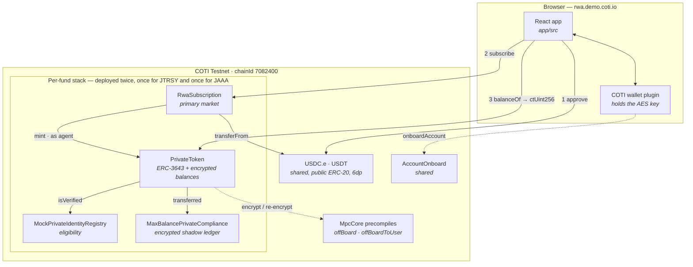
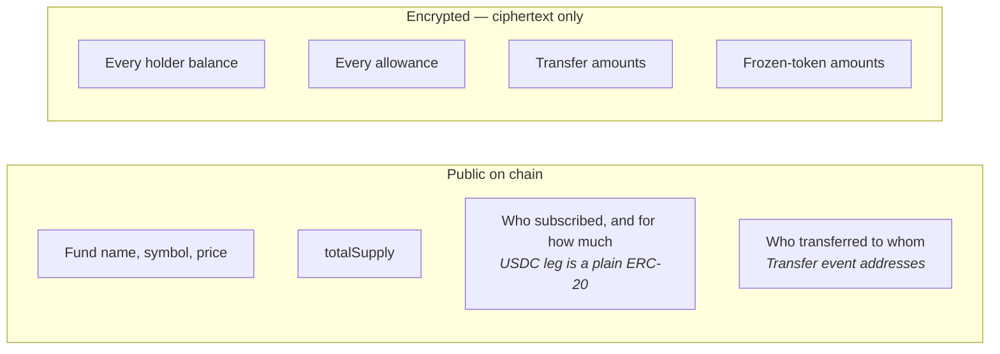
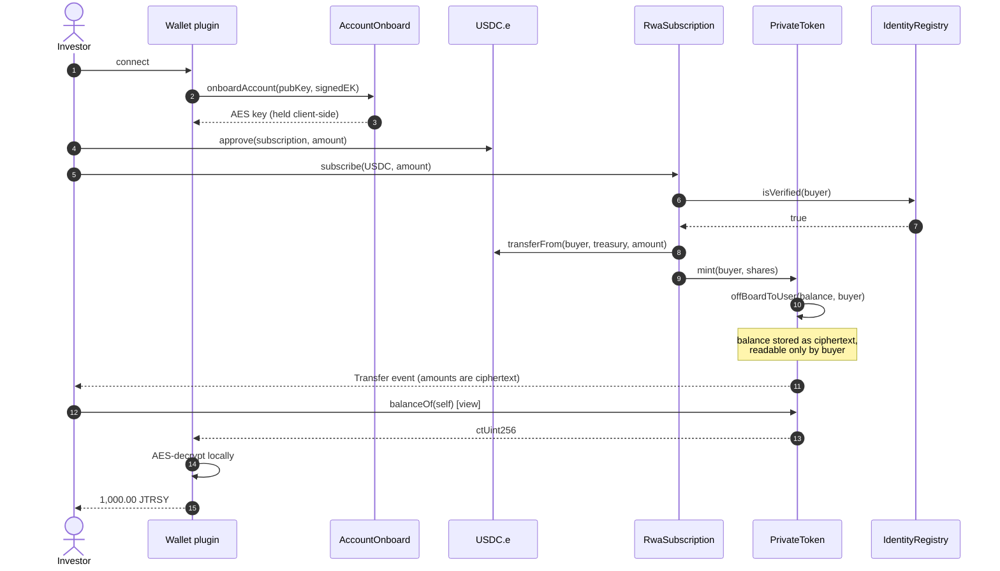

# Private ERC-3643 on COTI

A working port of the ERC-3643 permissioned-security-token standard onto COTI's
garbled-circuit MPC, so that **holder balances, allowances and transfer amounts are
encrypted on chain** while the compliance and identity machinery that makes ERC-3643 a
security token keeps working.

It is deployed, executing on COTI testnet, and it is what
**<https://rwa.demo.coti.io>** talks to.

---

## Why this exists

ERC-3643 (T-REX) is the de-facto standard for tokenised real-world assets: every transfer
is gated on an identity registry and a set of compliance modules, so the token can only
move between eligible holders. What it does *not* do is hide anything. Balances, transfer
sizes and cap-table structure are all public — which is exactly the property a regulated
fund cannot accept. A tokenised treasury fund whose entire investor register is readable
by a competitor is not a product.

COTI's MPC gives you the missing half: values live on chain as ciphertext and are computed
on under garbled circuits, so the chain enforces the rules without seeing the numbers. The
question this port answers is whether the two halves actually compose.

**They do.** Concretely:

| Question | Answer |
| -------- | ------ |
| Can COTI's published MPC library stand in for the unpublished `bubble/` library the upstream private fork depends on? | **Yes** — `MpcCore.sol` here is byte-identical to [`coti-io/coti-contracts`](https://github.com/coti-io/coti-contracts/tree/main/contracts/utils/mpc), no stubs, no local edits. |
| Can an MPC-layer `permit` ACL be translated to COTI's one-reader-per-ciphertext `offBoard` model? | **Yes**, and it is done — all **61 permit call sites are gone**. |
| Does it deploy and execute on a live chain? | **Yes** — nine contracts on chain `7082400`, 60 tests passing against testnet. |

```
Compiled 22 Solidity files successfully (evm target: paris)
PrivateToken: 22,309 bytes deployed
```

`tree/` holds the port itself, minus `node_modules` and build output.

---

## Architecture

Two funds, each a self-contained ERC-3643 stack, plus a shared onboarding contract and a
React frontend. Nothing is shared between funds except the payment tokens — separate
registries mean separate investor registers.



The frontend never sees a plaintext balance from the chain. `balanceOf` returns a
`ctUint256` — the caller's own ciphertext — which the wallet plugin decrypts in the browser
with the user's AES key. **The key never leaves the client.**

### The privacy model, and where it stops

This is the part worth understanding before anyone quotes the demo as a privacy claim.



Subscription is deliberately *not* private: USDC and USDT on COTI testnet are ordinary
ERC-20s with public amounts, and because the share price is public, the share count follows
from the payment. **Confidentiality begins at the first transfer, not at the purchase.**
Closing that gap needs a confidential payment token or off-chain settlement. Transfer
*graph* metadata (who paid whom) also stays public — only the amounts are hidden.

### Subscription flow



---

## Deployed contracts

There are **two independent deployments** on chain `7082400` (COTI testnet). They are easy
to confuse — read both sections before verifying anything, because only the second backs
the website. Explorer: <https://testnet.cotiscan.io>.

### 1. The RWA demo stack — what the website uses

`tree/deployments/rwa-demo.json`. Deployed **10 August 2026** by `scripts/deploy-rwa-demo.ts`.
Two funds, each with its own registry, compliance module and `PrivateToken`, plus an
`RwaSubscription` priced in testnet USDC and USDT, and one shared `AccountOnboard`.

The frontend reads this file directly — `rwa/app/src/data/deployment.json` is a copy of it,
and **the two must stay identical** or the site points at the wrong contracts.

| Contract | JTRSY — Janus Henderson Treasury Fund | JAAA — Janus Henderson AAA CLO Fund |
| -------- | ------------------------------------- | ----------------------------------- |
| `PrivateToken` | [`0x6D7cf587dbF68eb233B7BEd1f45BDfB6aE31Baf3`](https://testnet.cotiscan.io/address/0x6D7cf587dbF68eb233B7BEd1f45BDfB6aE31Baf3) | [`0x20b2C3cc4F7b4a5f727b1aa69779aD9C20036732`](https://testnet.cotiscan.io/address/0x20b2C3cc4F7b4a5f727b1aa69779aD9C20036732) |
| `MockPrivateIdentityRegistry` | [`0x9Da490afb22cEb1B8aA82d2EC4418BB4A62e5F37`](https://testnet.cotiscan.io/address/0x9Da490afb22cEb1B8aA82d2EC4418BB4A62e5F37) | [`0xC64DC85109E823380ea4DE34b6ac1B22a02Ba23E`](https://testnet.cotiscan.io/address/0xC64DC85109E823380ea4DE34b6ac1B22a02Ba23E) |
| `MaxBalancePrivateCompliance` | [`0xB5d2e8880005dCF84f13Fc58626d7F67734E28CB`](https://testnet.cotiscan.io/address/0xB5d2e8880005dCF84f13Fc58626d7F67734E28CB) | [`0x2abfd1194120fb2BDc2D3Fd8366C2979c7aea531`](https://testnet.cotiscan.io/address/0x2abfd1194120fb2BDc2D3Fd8366C2979c7aea531) |
| `RwaSubscription` | [`0x5cf23F0cf6369477d1F267e5f9F281C3e6B8A98f`](https://testnet.cotiscan.io/address/0x5cf23F0cf6369477d1F267e5f9F281C3e6B8A98f) | [`0x0A1089dc8b71E463c3AD89363058B5a07A7f1bf9`](https://testnet.cotiscan.io/address/0x0A1089dc8b71E463c3AD89363058B5a07A7f1bf9) |
| Share price at deploy | 1.112439 | 1.044450 |

Shared and pre-existing:

| Contract | Address | Note |
| -------- | ------- | ---- |
| `AccountOnboard` | [`0x686035856C60D73843C839ad50eDC6c40385C825`](https://testnet.cotiscan.io/address/0x686035856C60D73843C839ad50eDC6c40385C825) | Recorded for completeness; the frontend does **not** read it — onboarding is owned by the COTI wallet plugin, which ships its own contract |
| `USDC.e` | [`0x63f3D2Cc8F5608F57ce6E5Aa3590A2Beb428D19C`](https://testnet.cotiscan.io/address/0x63f3D2Cc8F5608F57ce6E5Aa3590A2Beb428D19C) | Pre-existing testnet bridged USDC, 6dp |
| `USDT` | [`0x9e961430053cd5AbB3b060544cEcCec848693Cf0`](https://testnet.cotiscan.io/address/0x9e961430053cd5AbB3b060544cEcCec848693Cf0) | Pre-existing testnet Tether, 6dp |

Deployer / treasury: `0xAb81c57CCc578a5636BFF47B896BEC6Af1c30012`. Shares are 8dp; prices are
quoted in payment-token units per `1e8` shares.

### 2. The B6 proof deploy — kept for the mint evidence

`tree/deployments/coti-testnet.json`. Deployed **9 August 2026**. A single `pTREX` token used
to prove the port executes. **Nothing consumes this stack**; it is kept because the mint
evidence below refers to it.

| Contract | Address |
| -------- | ------- |
| `PrivateToken` (pTREX) | [`0xa885398494fB02916C1AeC8Bd31DD7d1a0694Bd7`](https://testnet.cotiscan.io/address/0xa885398494fB02916C1AeC8Bd31DD7d1a0694Bd7) |
| `MaxBalancePrivateCompliance` | [`0xc3b5F4eFe6954EC39598D83b5Ea033273eefB917`](https://testnet.cotiscan.io/address/0xc3b5F4eFe6954EC39598D83b5Ea033273eefB917) |
| `MockPrivateIdentityRegistry` | [`0x05f99994eF7E27792C36353065A6E12Ba9f2bEF7`](https://testnet.cotiscan.io/address/0x05f99994eF7E27792C36353065A6E12Ba9f2bEF7) |

A mint of 1,000 pTREX (tx `0x5c5d34ae…`, 823,651 gas) proved three things a compiler could
not: `MintRequested` and `MintFinalized` fired in the **same transaction**, so the
synchronous decrypt shim replaces the upstream off-chain relayer; the public `totalSupply`
reconciled to exactly `100000000000`; and decrypting `balanceOf` with the holder's AES key
returns **1000**, so the eager `offBoardToUser` copy is genuinely readable by its owner.

### Verification status

Verified against chain on **25 August 2026** by `eth_getCode`: seven of the nine contracts
are **byte-identical** to the artifacts this tree compiles, metadata hash included. The two
`RwaSubscription` copies differ at exactly two 20-byte runs — offsets 155 and 522, the
`immutable token` slot, which the constructor fills with each fund's own token address —
and in their metadata hash, because a comment in `RwaSubscription.sol` was edited after
deployment. The executable body is bit-identical across that edit, so the deployed code is
this source. Anything beyond those two runs would mean the chain and the tree have
genuinely diverged.

On-chain state matches the JSON for both funds: name, symbol, 8 decimals, `identityRegistry`,
`compliance`, `subscription.token()`, and `priceOf()` for both payment tokens; both tokens
are unpaused and both subscriptions are agents of their token.

> **`evmVersion` must be `paris`.** COTI rejects Shanghai `PUSH0`. This tree compiled for
> `cancun` through the early phases and would never have deployed — compiling is not deploying.

---

## How the ACL was translated

This is the core of the port, and the part a reviewer should read first.

The upstream private fork enforces its ACL *in the MPC layer*: a handle carries its own
reader list, extended after the fact by `permit`. COTI has no such list — **a ciphertext has
exactly one reader, fixed when it is written.** So the ACL became ordinary Solidity, and the
encryption target became a consequence of it.

| Upstream call | Count | Became |
| ------------- | ----- | ------ |
| `permitThis(v)` | 23 | `MpcCore.offBoard(v)` — the contract copy |
| `permit(v, addr)` | 27 | `MpcCore.offBoardToUser(v, addr)` — that reader's copy |
| `permitTransient(v, addr)` | 10 | **Deleted.** `gt` values already cross contracts within a transaction |
| `isSenderPermitted(v)` | 1 | **Deleted.** `validateCiphertext` carries a signature, so the binding is intrinsic |

Values are written **eagerly** wherever the reader is known and bounded, and **on demand**
only for the agent role, which is unbounded. On-demand is not the default because it
converts every read into an on-chain record of who read whose position.

| Value | Readers | Strategy |
| ----- | ------- | -------- |
| Balances | contract + holder | Eager `utUint256` |
| Allowances | contract + owner + spender | Eager three-ciphertext `PrivateAllowance` |
| Transferred amount | contract + sender + receiver | Eager, emitted as two ciphertexts |
| Frozen tokens | contract + holder + **agents** | Eager for the holder; agents call `reencryptFrozenTokens` |
| Key rotation | — | `setAccountEncryptionAddress`, the repair path |

---

## Behavioural changes a reviewer must not miss

1. **Events carry ciphertexts, not handles.** `Transfer` and `Approval` now emit one
   ciphertext per party (`_fromValue` / `_toValue`, `_ownerValue` / `_spenderValue`),
   mirroring COTI's `PrivateERC20`. A `gtUint256` in a log is meaningless once the
   transaction ends. **Any indexer reading amounts from logs must change.**
2. **`balanceOf`, `allowance` and `getFrozenTokens` return `ctUint256`,** the caller's copy,
   to be decrypted off-chain. They are `view` again.
3. **The `recoveryAddress` guard was repaired.** Upstream compared a stored handle against
   its canonical zero handle — a pointer comparison that only worked because that handle was
   stable storage. Under COTI two fresh handles are always unequal, so a literal port would
   have made the check *always pass*. It now tests whether the balance slot was ever
   written. A true "balance is non-zero" test is not available without decrypting, on either
   system.
4. **Storage layout changed** — `_balances` and `_frozenTokens` are `utUint256`, `_allowances`
   is a three-ciphertext struct, and two mappings were added. `__gap` dropped 45 → 43 to
   compensate. This contract is upgradeable; **the layout is not compatible with a deployed
   upstream instance.**

---

## What is still not done

- **The ten unported compliance modules** remain the main gap. Only
  `MaxBalancePrivateCompliance` exists in a private form.
- **`forcedTransfer`, `batchForcedTransfer` and batch freeze/unfreeze take `gtUint256`** and
  are therefore **uncallable from outside on COTI** — a garbled handle cannot survive a
  transaction boundary. They need `itUint256` parameters. Two tests pin the behaviour.
- **Identity registries are mocks.** `MockPrivateIdentityRegistry` is an owner-controlled
  allowlist, not a real ONCHAINID claim check.
- **Subscription is not confidential** — see the privacy diagram above.
- **Nothing is audited**, and 823k gas for one mint is a data point, not a cost model.
- **Bytecode headroom is thin** — 22,309 of 24,576 bytes under Paris, ~2.3 KB left. Adding
  six more compliance modules will need library extraction.
- The upstream test suites were **rewritten against the ct model** rather than repointed —
  they assumed durable `gtUint256` handles in storage, which this port removed. Every
  original test intent is preserved, including four that assert the `gtUint256` entry points
  are unreachable.

---

## Repository layout

```
private-ERC-3643-coti-port/
└── tree/
    ├── contracts/
    │   ├── bubble/          MpcCore, MpcInterface (vendored from coti-contracts),
    │   │                    DecryptionCaller (written here)
    │   ├── token/           PrivateToken, PrivateTokenStorage, IPrivateToken — the port
    │   ├── registry/        ERC-3643 identity registries
    │   ├── compliance/      modular compliance interfaces
    │   ├── factory/         TREXFactory, TREXGateway
    │   └── proxy/           upgradeable proxies
    ├── contracts-private/   RwaSubscription, MaxBalancePrivateCompliance,
    │                        AccountOnboard, test mocks
    ├── scripts/             deploy, verify, decrypt, RPC retry proxy
    ├── test/                60 tests passing against live testnet
    ├── deployments/         rwa-demo.json (the website) · coti-testnet.json (proof deploy)
    └── docs/                generated natspec
```

---

## Building and running

```sh
cd tree
npm install
npx hardhat compile --config hardhat.private.config.ts
```

### Deploy

```sh
# The RWA demo stack the website uses. Rewrites deployments/rwa-demo.json; after running it,
# copy that file to rwa/app/src/data/deployment.json or the site keeps the old addresses.
npx hardhat run scripts/deploy-rwa-demo.ts        --config hardhat.private.config.ts --network coti-testnet

# The proof deploy. verify-deployment.ts reads deployments/coti-testnet.json and so checks
# only that stack — it does not look at the demo contracts.
npx hardhat run scripts/deploy-private-token.ts   --config hardhat.private.config.ts --network coti-testnet
npx hardhat run scripts/verify-deployment.ts      --config hardhat.private.config.ts --network coti-testnet
npx hardhat run scripts/decrypt-balance.ts        --config hardhat.private.config.ts --network coti-testnet
```

Deploying to `coti-mainnet` requires `ALLOW_MAINNET=true`.

### Test — 60 passing, against live testnet

```sh
npx hardhat test test/token/private-token-coti.tests.ts                    --config hardhat.private.config.ts --network coti-testnet
npx hardhat test test/token/private-token-coti-allowances.tests.ts         --config hardhat.private.config.ts --network coti-testnet
npx hardhat test test/token/private-token-transfer.tests.ts                --config hardhat.private.config.ts --network coti-testnet
npx hardhat test test/token/private-token-max-balance-compliance.tests.ts  --config hardhat.private.config.ts --network coti-testnet
```

`testnet.coti.io` currently 502s on roughly half of all requests. Run the retrying proxy
first or no run will finish:

```sh
node scripts/rpc-retry-proxy.js &
COTI_TESTNET_RPC_URL=http://127.0.0.1:8545 npx hardhat test ... --network coti-testnet
```

Tests need `PRIVATE_KEY2` as a second funded signer. Credentials are read from the
research-root `.env` (`PRIVATE_KEY`, `PRIVATE_AES_KEY_TESTNET`); the config falls back to it
so secrets never sit inside this tree.

### Two gotchas worth knowing before writing any COTI client

- **Encrypted inputs are signed with a raw ECDSA signature over the digest, serialised
  `r || s || (v − 27)`** — not `personal_sign`, and `v` is 0/1.
- **COTI testnet returns no revert data**, so `revertedWith` misreports a reverting
  transaction as succeeding. Assert failure, not reason.

### Toolchain caveats

- **solc 0.8.25, not 0.8.24.** 0.8.24 could not be fetched in the build environment. Both
  satisfy the `^0.8.24` and `^0.8.20` pragmas, but a production port should pin what
  upstream pins.
- **`viaIR: true`** changes the optimiser pipeline and needs its own gas and audit review.

---

## Changes made to the upstream work

Required by GPL-3.0 §5(a), and worth reading regardless.

| # | File | Change |
| - | ---- | ------ |
| 1 | `contracts/bubble/MpcCore.sol` | **Added**, unmodified, from `coti-io/coti-contracts` @ `6fbdce0` |
| 2 | `contracts/bubble/MpcInterface.sol` | **Added**, unmodified, same commit |
| 3 | `contracts/bubble/DecryptionCaller.sol` | **Written here.** Synchronous stand-in for the upstream async decrypt oracle, over `MpcCore.decrypt` |
| 4 | `contracts/token/PrivateTokenStorage.sol` | Storage moved from `gtUint256` handles to `utUint256` / `ctUint256`; `PrivateAllowance` added; reader and encryption-address mappings added; `__gap` 45 → 43 |
| 5 | `contracts/token/PrivateToken.sol` | 61 permit sites translated; ciphertext helpers added; `reencryptFrozenTokens`, `frozenTokensFor` and `setAccountEncryptionAddress` added; getters return ciphertexts; `recoveryAddress` guard repaired |
| 6 | `contracts/token/IPrivateToken.sol` | Event and getter signatures moved from `gtUint256` to `ctUint256` |
| 7 | `contracts-private/MaxBalancePrivateCompliance.sol` | Shadow ledger moved to `ctUint256`; permits removed |
| 8 | `contracts-private/PrivateTokenTestMocks.sol` | Permits removed |
| 9 | `hardhat.private.config.ts` | `viaIR: true`; solc `0.8.24` → `0.8.25`; **`evmVersion` cancun → paris** (COTI rejects `PUSH0`); `coti-testnet` / `coti-mainnet` networks; `.env` fallback to the research root |
| 10 | `.gitignore` | `contracts/bubble/` un-ignored — upstream excludes it because their library is unpublished; here it holds the COTI library |
| 11 | `scripts/deploy-private-token.ts`, `verify-deployment.ts`, `decrypt-balance.ts` | **Added.** Deployment and on-chain verification for COTI |
| 12 | `test/token/helpers/cotiCrypto.ts`, `test/token/private-token-coti.tests.ts`, `private-token-coti-allowances.tests.ts` | **Added.** COTI-native crypto and account onboarding replacing the bubble proxy, plus 23 tests passing against testnet |
| 13 | `contracts-private/AccountOnboard.sol`, `scripts/rpc-retry-proxy.js` | **Added.** COTI's onboarding contract vendored so fixtures can deploy it, and a retrying RPC proxy that works around testnet 502s |
| 14 | `contracts-private/RwaSubscription.sol`, `scripts/deploy-rwa-demo.ts` | **Added.** Primary-market subscription priced in stablecoins, and the two-fund demo deployment |

## Licence and provenance

Derived from [`soda-mpc/private-ERC-3643`](https://github.com/soda-mpc/private-ERC-3643)
@ `c1db386` (10 April 2026), itself a fork of
[`ERC-3643/ERC-3643`](https://github.com/ERC-3643/ERC-3643) v4.1.3.

**Licensed GPL-3.0.** `tree/LICENSE.md` is preserved, and the table above is the statement
of changes that §5(a) requires. Anything shipped derived from this stays GPL-3.0.
